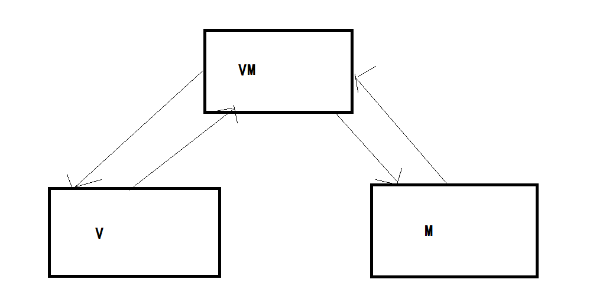
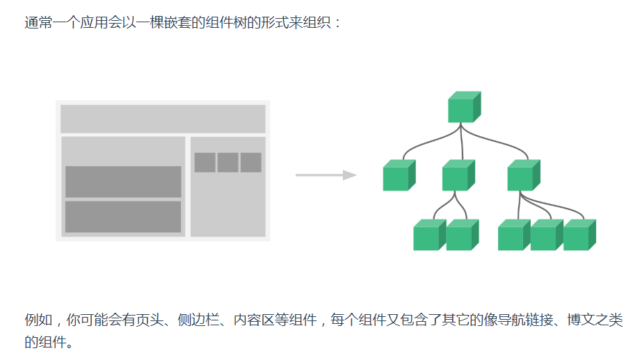
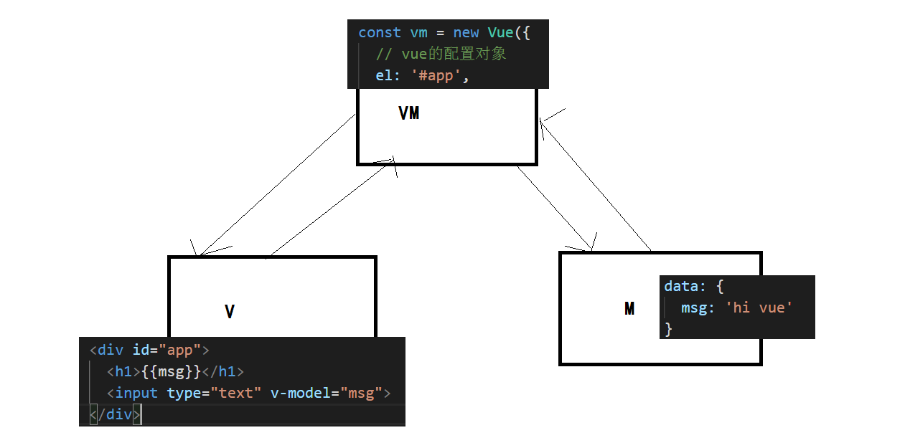

## VUE基础-day01

> 自我介绍：周老师，江西人

> 课程介绍：vue基础（7天），黑马头条-自媒体端PC（10天），webpack（1天），黑马头条M端，vue进阶


### 01-vue是什么

> 目标：了解vue的基础概念

官网地址： https://cn.vuejs.org/ 

官方解释：渐进式javascript框架


区别前端技术叫法：

- 库
  - 提供了可调用的API，自己组织功能代码，调用API实现功能。例如：jquery zepto
- 插件
  - 基于js或者基于jquery来实现某一个特定专项的功能。例如：jquery.color.js
- ui框架
  - 关注于用户界面功能，有一套自己的样式风格，提供了很多网站开发常用的功能控件（下拉框，对话框，分页...）。例如：bootstrap，layer，layui，easyui... 基于jquery的。
- js框架
  - js框架约定好了开发的套路，使用框架提供的**规则**来进行开发。例如：vue react angular


总结：vue是一个js框架，提供了一套开发规则，按照这个开发规则可提高开发效率。

补充：渐进式意思是，vue.js本身功能局限，一旦配合其他的工具可以增加其能力。

- vue-router
- vuex
- axios
- nuxt


### 02-vue做什么

> 目标：了解vue适合什么类型的项目


区分下项目类型：

- 传统类型项目
  - 前后端在一个项目中，然后网站场景的切换通过页面跳转来实现。
  - 例如：阿里百秀  大事件

- SPA类型的项目（前后端分离）
  - single page application  单页面应用程序
  - 大白话：把一个网站的所有功能在一个页面中实现，没有真正的页面跳转。
  - 例如：
    -  https://music.163.com/  网易云音乐
    -  http://zhoushugang.gitee.io/hm-toutiao-pc-93/   黑马头条
  - 这种类型的项目业务复杂度非常高，所以会使用js框架来实现。


总结：vue适用于开发SPA类型的系统。


### 03-vue的核心

> 目标：了解vue的几个核心功能

- 数据驱动视图（页面）

以前：根据数据和模板解析成html格式的代码，自己手动的渲染到对应的位置。需要大量的操作dom。

现在：你只需要修改绑定的数据（页面上依赖数据），就能对应的更新视图（页面），极大的解放了操作dom的工作，提供开发效率。

- MVVM模式
  - M  数据模型  model
  - V   视图（页面）view
  - VM  数据模型和视图的控制器   viewmodel
  - 数据双向绑定



- 组件化开发




- 把页面按照界面功能（导航，侧边栏，下拉框）拆分业务，每一个组件时一个独立的功能，提高代码可维护性，和复用度。


总结：vue的核心功能，数据驱动视图，双向数据绑定（MVVM）,组件化开发。


### 04-vue的安装

> 目标：知道vue的几种安装方式


通过script引入

- 本地下载
  - https://cn.vuejs.org/js/vue.js 下载地址
  - 放在本地项目，script引入即可
- cdn的方式
  - `  <script src="https://cdn.jsdelivr.net/npm/vue@2.6.11"></script>  `


通过npm安装

- 下载 `npm i vue`
- 导入 `const Vue = require('vue')`   `import Vue from 'vue'`
- 注意 前端开发，在浏览器运行不行。
- 需要借助一些工具才能支持 以上写法。


总结：在基础学习阶段，建议大家使用本地下载引入的方式。


### 05-体验vue

> 目标：体验vue的基础写法，完成一个基于vue的程序

体验的例子代码：

```html
<!DOCTYPE html>
<html lang="en">
<head>
  <meta charset="UTF-8">
  <meta name="viewport" content="width=device-width, initial-scale=1.0">
  <title>01-vue体验</title>
</head>
<body>
  <!-- 1. 两个标签  h1  input , 有一个字符串数据， 把数据渲染到这两个标签 -->
  <!-- 2. input输入内容的时候，收集输入的内容，h1标签的内容改成你输入的内容 -->
  <div id="app">
    <h1>{{msg}}</h1>
    <input type="text" v-model="msg">
  </div>
  <!-- 引入 -->
  <script src="./vue.js"></script>
  <script>
    // 当你导入vue.js后，全局环境中拥有一个构造函数，Vue
    const vm = new Vue({
      // vue的配置对象
      el: '#app',
      data: {
        msg: 'hi vue'
      }
    })
  </script>
</body>
</html>
```

和mvvm联系起来




### 06-★选项-el

> 目标：掌握vue选项el的使用，了解使用时注意事项。

作用：为实例化好的vm对象（vue实例）指定它管理的容器（标签）视图。

- 大白话，一个vue实例去管理一个容器。

如何指定(el可以写什么)：

- 选择器  `#app`
- dom对象  `document.getElementById('app')`

```html
<!DOCTYPE html>
<html lang="en">
<head>
  <meta charset="UTF-8">
  <meta name="viewport" content="width=device-width, initial-scale=1.0">
  <title>Document</title>
</head>
<body>
  <!-- 容器 视图 -->
  <div id="app">
    <h1>{{msg}}</h1>
  </div>
  <!-- 在来一个容器 -->
  <div id="app2">
    <h1>{{msg}}</h1>
  </div>
  <script src="./vue.js"></script>
  <script>
    const vm = new Vue({
      // vue的选项，el选项的作用指定vue实例管理的容器
      // 选择器
      // el: '#app',
      // dom对象
      el: document.querySelector('#app'),


      data: {
        msg: 'hi vue'
      }
    })

    // 一个vue实例管理一个视图，在次创建一个即可
    const vm2 = new Vue({
      el: '#app2',
      data: {
        msg: 'hi vue 2'
      }
    })

    // 那么是否可以管理 body html 这样的容器，一个vue实例够用了。
    // vue不允许去指定 body html 这个样的根标签
    // Do not mount Vue to <html> or <body> - mount to normal elements instead.
    new Vue({
      el: 'body'
    })
  </script>
</body>
</html>
```

注意：el不能使用body和html标签作为视图容器


总结：el指定vue实例管理哪个容器（视图）


### 07-★选项-data

> 目标：掌握vue选项data的使用，了解使用时注意事项。

作用：在模板（视图）中需要使用的数据必须在data当中声明，任何格式数据都可以。

特点：data中**显性声明**的数据都是响应式数据（当数据发生变化的时候，使用数据的视图也自动更新）


演示数据驱动视图，就需要去改数据

- `const vm = new Vue()`   在全局变量中 vm 对象就是vue的实例
- 通过vue的实例，可以去访问数据，可以去修改数据
- 通过 `vm.$data` 可访问当选项data传入给Vue构造函数的数据，传入的data挂载到$data.
- 使用 `vm.$data.msg = '10086'` 修改msg数据，数据驱动视图的更新。
- 但是每次 `vm.$data`  才能访问到数据和修改数据，略显的麻烦。
- vue把`vm.$data`上的每一项数据代理在vm对象上（vue实例上），所以直接通过vm即可访问
  - 在实例化的对象中有this就是vm就是vue实例，在对象内部访问数据直接使用this即可。
- 所以 修改数据 `vm.msg = 10010` 即可


注意：如果想声明成响应式数据，一定要是显性的声明。

```
data: {
	msg: '123'
	user: {
		// 没有声明任何字段
		// 但是将来  vm.user = {name:'tom'}
		// name字段就不是显性声明
	}
}
```


```html
<!DOCTYPE html>
<html lang="en">
<head>
  <meta charset="UTF-8">
  <meta name="viewport" content="width=device-width, initial-scale=1.0">
  <title>Document</title>
</head>
<body>
  <div id="app">
    <h1>{{msg}}</h1>
    <i>{{user.name}}</i>
  </div>
  <script src="./vue.js"></script>
  <script>
    // 实例化vue
    const vm = new Vue({
      el: '#app',
      // vue选项，data作用是声明响应式数据
      data: {
        msg: 'hi vue',
        user: {
          // 如果模板需要使用必须显性声明，但是可以不给值
          name: ''
        }
      }
    })
  </script>
</body>
</html>
```


总结：

- data中声明的数据是响应式数据
- 如果模板中使用的字段，建议在data中提前声明（显示声明）
- 在模板中如果使用 `{{字段名称}}`   即可输出字段对应的数据


### 08-★选项-methods

> 目标：掌握vue选项methods的使用，了解使用时注意事项。

作用：在vue程序中，vue实例中，需要使用的函数统一在methods进行定义。

大白话：你需要的业务函数都写在methods选项中，类型是对象可以写很多函数。


使用：

- 在模板中可以使用定的函数
- 在vue实例中也可以使用函数

```html
<!DOCTYPE html>
<html>
  <head>
    <meta charset="UTF-8" />
    <meta name="viewport" content="width=device-width, initial-scale=1.0" />
    <title></title>
  </head>
  <body>
    <div id="app">
      {{say()}}
      <hr>
      {{say2()}}
      <hr>
      {{say3()}}
      <hr>
      {{say4()}}
    </div>
    <script src="./vue.js"></script>
    <script>
      const vm = new Vue({
        el: '#app',
        data: {
          msg: 'hi vue'
        },
        // vue选项，methods定义函数
        // 在此处定义的函数，可以通过vm调用，vue实例进行调用
        // 在模板中页可以使用，函数的名称() 会输出函数返回值
        // 注意：在模板中访问 数据 函数 不需要使用this
        methods: {
          // 1. 传统写法
          say: function () {
            console.log('say')
            // 如果函数有返回值，在模板中调用函数，会输出返回值。
            return 'hi vue'
          },
          say2: function () {
            // 在methods中声明的函数，其中的this就是vm实例
            // this.say()
            return 'say2函数' + this.msg
          },
          // 2. 箭头函数写法
          say3: () => {
            console.log('say3函数执行了')
            // 注意：如果是箭头函数本身是没有this的，使用外层作用域的this
            // 此时的外层作用域的this是window而不是vm，不能访问vue实例的数据和函数
            // 建议：在methods中的函数尽量别写箭头函数，我们会经常访问数据和函数
            console.log(this.msg)
          },
          // 3. 属性简写写法  === say4:function(){}
          say4 () {
            return this.msg + 'say4函数'
          }
        }
      })
    </script>
  </body>
</html>
```


总结：

- mehtods选项声明函数，建议使用属性简写方式 `say(){}`
- 函数中的this就是vm实例（vue实例）
- 通过vm使用，通过this使用，在模块中省去this直接使用，会输出return的结果。


###  09-术语-插值表达式

> 目标：理解插值表达式作用和使用场景

作用：在模板中输入内容，把数据对应的值插入到模板当中（视图中）

语法：在被vue管理的视图中 `{{ 任何js表达式 }}`


可以使用任何js表达式

- 运算 `1 + 1`
- 三元表达式  `10 > 100 ? '1':'2'`
- 访问数据  `msg`
- 访问函数  `say()`
- ....

但是不能使用js语句

- `if else`  分支语句
- `for()`  循环语句
- `var a = 10`  声明变量


```html
<!DOCTYPE html>
<html>
  <head>
    <meta charset="UTF-8" />
    <meta name="viewport" content="width=device-width, initial-scale=1.0" />
    <title></title>
  </head>
  <body>
    <div id="app">
      <!-- js表达式 -->
      {{1+1}}
      <hr>
      {{count>=10?'十位数':'个位数'}}
      <hr>
      {{count}}
      <hr>
      {{say()}}
      <hr>
      <!-- 以下是js语句  不支持-->
      <!-- {{ if () {} }} -->
      <!-- {{var a = 10}} -->
    </div>
    <script src="./vue.js"></script>
    <script>
      const vm = new Vue({
        el: '#app',
        data: {
          count: 9
        },
        methods: {
          say () {
            return 100
          }
        }
      })
    </script>
  </body>
</html>
```


总结：

- 在模板中的 `{{}}` 就是插值表单式
- 里面可以写任意js表达式，输出期结果到模板中
- 模板：el指定的容器，理解成是模板。


### 10-术语-指令

> 目标：理解指令的作用和使用场景


### 11-指令-v-text和v-html

> 目标：掌握通过数据去控制标签的内容


###  12-指令-v-show和v-if

> 目标：掌握通过数据去控制标签的显示隐藏


### 13-指令-v-on

> 目标：掌握基于vue的事件绑定


###  14-指令-v-bind

> 目标：掌握通过数据去控制标签的属性值


### 15-指令-v-for

> 目标：掌握通过数据去遍历标签


###  16-案例

> 目标：串一串今日知识点