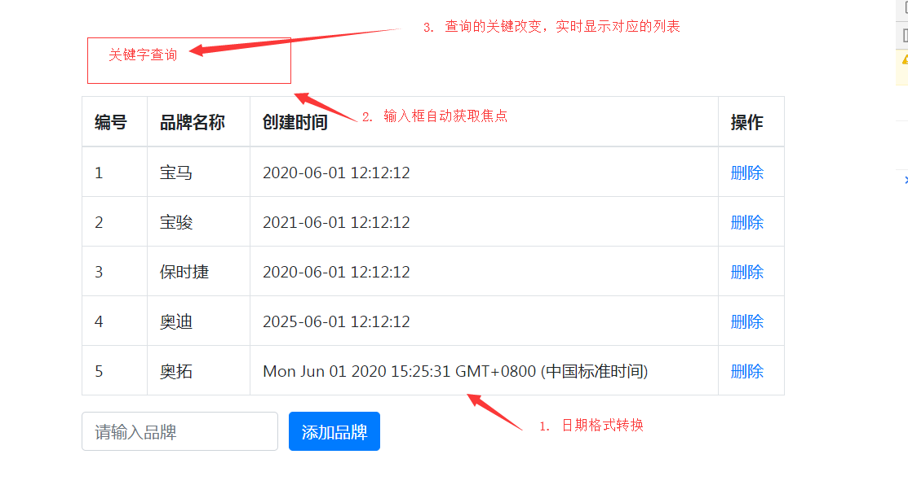

## VUE基础-day02

### 01-每日回顾

vue是什么

- 它就js框架，有自己的开发规则。

vue做什么

- 适合做SPA类型的系统

vue核心

- 数据驱动视图，MVVM模式，组件化开发

vue的配置选项

- el   指定vue实例管理的视图容器
- data   声明响应式数据
- methods   定义函数

术语

- 插值表达式 `{{}}`
- 指令  `v-*` 的属性

指令

- v-text    更新替换标签内容，文本
- v-html    更新替换标签内容，html
- v-show  显示隐藏
- v-if  移除创建
- v-on  绑定事件
- v-bind  绑定属性
- v-for  进行遍历


准备静态页面：

```html
<!DOCTYPE html>
<html lang="en">
<head>
  <meta charset="UTF-8">
  <meta name="viewport" content="width=device-width, initial-scale=1.0">
  <title>案例</title>
  <link rel="stylesheet" href="./bootstrap.min.css">
</head>
<body>
  <div id="app" class="container" style="padding-top: 100px;">
    <table class="table table-bordered">
      <thead>
        <tr>
          <th>编号</th>
          <th>品牌名称</th>
          <th>创建时间</th>
          <th>操作</th>
        </tr>
      </thead>
      <tbody>
        <tr>
          <td>1</td>
          <td>宝马</td>
          <td>2010-10-10 10:10:10</td>
          <td>
            <a href="#">删除</a>
          </td>
        </tr>
      </tbody>
    </table>
  </div>
  <script src="./vue.js"></script>
</body>
</html>
```


### 02-案例-渲染列表

实现的大致步骤：

- 准备表格所需数据
- 使用v-for指令进行遍历 （tbody--->tr）

落地的代码：

```html
<!DOCTYPE html>
<html lang="en">
<head>
  <meta charset="UTF-8">
  <meta name="viewport" content="width=device-width, initial-scale=1.0">
  <title>案例</title>
  <link rel="stylesheet" href="./bootstrap.min.css">
</head>
<body>
  <div id="app" class="container" style="padding-top: 100px;">
    <table class="table table-bordered">
      <thead>
        <tr>
          <th>编号</th>
          <th>品牌名称</th>
          <th>创建时间</th>
          <th>操作</th>
        </tr>
      </thead>
      <tbody>
        <!-- v-for="每个选项变量名称 in  data数据中的数组" -->
        <tr v-for="brand in brandList" :key="brand.id">
          <td>{{brand.id}}</td>
          <td>{{brand.brandName}}</td>
          <td>{{brand.createTime}}</td>
          <td>
            <a href="#">删除</a>
          </td>
        </tr>
      </tbody>
    </table>
  </div>
  <script src="./vue.js"></script>
  <script>
    // 初始化
    const vm = new Vue({
      el: '#app',
      data: {
        // 品牌列表数据
        brandList: [
          {id:1,brandName:'宝马',createTime:'2020-06-01 12:12:12'},
          {id:2,brandName:'宝骏',createTime:'2021-06-01 12:12:12'},
          {id:3,brandName:'保时捷',createTime:'2020-06-01 12:12:12'},
          {id:4,brandName:'奥迪',createTime:'2025-06-01 12:12:12'}
        ]
      }
    })
  </script>
</body>
</html>
```


### 03-案例-完成删除

实现的大致步骤：

- 绑定删除按钮的点击事件
- 但是 删除是一个A标签  点击的时候默认发生跳转  需要阻止默认行为
- 指定一个处理函数，在函数中删除数组中对应的数据即可
  - **数据驱动视图**
- 在点击的时候给函数传入ID，根据ID找到索引，根据索引移除数组中的数据。
- 当列表无数据时，需要提示暂无数据。

落地代码：

- 绑定事件

```html
          <td>
            <a href="#" @click.prevent="delBrand(brand.id)">删除</a>
          </td>
```

- 指定函数

```js
      methods: {
        // 删除品牌
        delBrand (id) {
          // 1. 根据ID找到索引
          // 完整写法
          //const index = this.brandList.findIndex(function(item){
          //  return item.id === id
          //})
          const index = this.brandList.findIndex(item=>item.id===id)
          // 2. 根据索引删除数据
          this.brandList.splice(index,1)
        }
      }
```

- 处理无数据

```html
        <!-- 条件渲染使用v-if  显示的条件：数组没有长度 -->
        <tr v-if="brandList.length===0">
          <td colspan="4" style="text-align: center;">暂无数据</td>
        </tr>
```


额外知识：

- 概念：事件修饰符
- 例如：
  - 绑定的事件的时候阻止默认行为  `@click.prevent="处理函数"`
  - 绑定的事件的时候阻止默认冒泡  `@click.stop="处理函数"`


### 04-指令-v-bind绑定class

> 目标：通过数据的方式去操作class中的类名

作用：操作类名

想法：class属性是由多个类组成，使用对象或者数组


绑定对象：

- 语法：`<div :class="{类名:是否添加该类名,...}"></div>`
- 例如：`<div :class="{btn:true,red:false}"></div>`

```html
    <style>
      .bg{
        background: pink;
      }
      .red {
        color: red;
      }
    </style>
  </head>
  <body>
    <div id="app">
      <!-- 基本写法 -->
      <!-- <div :class="{bg:false,red:false}">使用对象操作类名</div> -->
      <!-- 通过数据来控制 单独控制-->
      <!-- <div :class="{bg:hasBg,red:hasRed}">使用对象操作类名</div> -->
      <!-- 通过数据来控制 完整控制 -->
      <button @click="classObject.bg=true">加bg</button>
      <button @click="classObject.red=true">加red</button>
      <div :class="classObject">使用对象操作类名</div>
    </div>
    <script src="./vue.js"></script>
    <script>
      const vm = new Vue({
        el: '#app',
        data: {
          // hasBg: false,
          // hasRed: false
          classObject: {
            bg: false,
            red: false
          }
        },
        methods: {}
      })
    </script>
  </body>
```


绑定数组：

- 语法：`<div :class="['类名1','类名2']"></div>`
- 例子：`<div :class="['bg','red']"></div>`

```html
      <!-- 基本写法 -->
      <!-- <div :class="['bg','red']">使用数组操作类名</div> -->
      <button @click="classArray.push('bg')">加bg</button>
      <button @click="classArray.push('red')">加red</button>
      <div :class="classArray">使用数组操作类名</div>
```

```diff
        data: {
          // hasBg: false,
          // hasRed: false
          classObject: {
            bg: false,
            red: false
          },
+          classArray: []
        },
```


补充：

- 如果既有 `class`  又有 `:class`  是什么效果
- class是默认类名，：class产生的类名会进行合并。


总结：

- v-bind绑定class可以使用对象可以使用数组进行操作。
- `:class="{类名：是否加类名}"`
- `:class="['类名']"`


### 05-指令-v-bind绑定style

> 目标：通过数据的方式操作行内样式

作用：通过vue的方式动态修改行内样式，也就是style属性。

想法：style属性是由多个css样式组成的，可使用对象，可使用数组。


使用对象绑定：

- 语法：`<div :style="{color:'red',fontSize:'20px'}" ></div>`
  - 如果属性中包含 - 符号   
    - 'font-size'   字符表示
    - fontSize   遵循驼峰

```html
    <div id="app">
      <!-- 基本写法 -->
      <!-- <div :style="{color:'red',fontSize:'20px'}">使用对象绑定style</div> -->
      <!-- 动态绑定 -->
      <button @click="objectStyle.color='pink'">加bg</button>
      <button @click="objectStyle.fontSize='100px'">加red</button>
      <div :style="objectStyle">使用对象绑定style</div>
    </div>
    <script src="./vue.js"></script>
    <script>
      const vm = new Vue({
        el: '#app',
        data: {
          // 对象style样式
          objectStyle: {color:'red',fontSize:'20px',backgroundColor:'none'}
        },
        methods: {}
      })
    </script>
```


使用数组绑定：

- 语法：`<div :style="[{color:'red'},{fontSize:'20px'}]" ></div>`
- 如果属性中包含 - 符号   
  - 'font-size'   字符表示
  - fontSize   遵循驼峰

```html
      <!-- 基本写法 -->
      <!-- <div :style="[{color:'blue'},{fontSize:'30px'}]">使用数组绑定style</div> -->
      <!-- 动态绑定 -->
      <button @click="arrayStyle.push({color:'blue'})">加颜色</button>
      <button @click="arrayStyle.push({fontSize:'30px'})">加字体大小</button>
      <div :style="arrayStyle">使用数组绑定style</div>
```

```diff
        data: {
          // 对象style样式
          objectStyle: {color:'red',fontSize:'20px',backgroundColor:'none'},
          // 数组style样式
+          arrayStyle: []
        },
```


疑问：

- 标签上同时存在 `style`  `:style`  结果是？
- 如果有一样的样式，会发生覆盖，不同的就追加。


总结：写法

- `:style="{csss属性:css属性值,...}"`
- `:style="[{csss属性:css属性值,...}]"`
- css属性值最好遵循驼峰命名，或者用引号包起来。


### 06-指令-v-model

> 目标：知道v-model的语法糖原理，知道任意表单元素进行双向数据绑定。


1、知道v-model的语法糖原理

- 提问：如果不用v-model你是否可以用现有学习的vue知识来实现双向数据绑定？
- 双向：
  - 数据到视图（把data中的数据赋值给表单元素） M->V
  - 视图到数据（当表单元素的内容发生改变的时候，获取改变的值修改data中的数据） V->M

不使用v-model实现双向绑定

```html
<!DOCTYPE html>
<html>
  <head>
    <meta charset="UTF-8" />
    <meta name="viewport" content="width=device-width, initial-scale=1.0" />
    <title></title>
  </head>
  <body>
    <div id="app">
      <h1>{{msg}}</h1>
      <!-- 不使用v-model -->
      <!-- 1. data中数据赋值给表单元素  v-bind:value="msg" -->
      <!-- 2. 当表单元素值改变后，获取其值去修改data中的数据-->
      <!-- 2.1 使用input事件监听值改变 -->
      <!-- 2.2 获取值通过dom对象获取value属性值 -->
      <!-- 2.3 把最新的值去修改data中的数据-->
      <input type="text" :value="msg" @input="msg=$event.target.value">
      <!-- 总结：v-model的语法糖原理是 使用:value赋值，使用@input改值 -->
    </div>
    <script src="./vue.js"></script>
    <script>
      const vm = new Vue({
        el: '#app',
        data: {
          msg: 'hi vue'
        },
        methods: {
          // fn (e) {
          //   // e.target 是事件触发源  当前的input标签
          //   // e.target.value 就是输入的值
          //   // console.log(e.target.value)
          //   this.msg = e.target.value
          // }
        }
      })
    </script>
  </body>
</html>
```

总结：**v-model的语法糖原理是 使用:value赋值，使用@input改值**


2、其他表单元素如何进行绑定

- 输入框
- 下拉框
- 复选框
- 单选框
- 文本域

```html
<!DOCTYPE html>
<html>
  <head>
    <meta charset="UTF-8" />
    <meta name="viewport" content="width=device-width, initial-scale=1.0" />
    <title></title>
  </head>
  <body>
    <div id="app">
      <!-- 输入框 -->
      <input type="text" v-model="str">
      <hr>
      <!-- 下拉框 -->
      <select v-model="subject">
        <!-- :value目的是让数值解析 number -->
        <option :value="1">前端</option>
        <option :value="2">java</option>
        <option :value="3">UI</option>
      </select>
      <hr>
      <!-- 复选框 -->
      <!-- 1. 单个复选框  表示布尔类型的值  true 选中 false 不选中 -->
      <input type="checkbox" v-model="isChecked">
      <hr>
      <!-- 2. 多个复选框 -->
      <input type="checkbox" value="book" v-model="hobby"> 书籍
      <input type="checkbox" value="ball" v-model="hobby"> 球类
      <input type="checkbox" value="game" v-model="hobby"> 游戏
      <hr>
      <!-- 单选框 -->
      <input type="radio" value="男" v-model="gender"> 男
      <input type="radio" value="女" v-model="gender"> 女
      <!-- 文本域 -->
      <hr>
      <textarea v-model="text"></textarea>
    </div>
    <script src="./vue.js"></script>
    <script>
      const vm = new Vue({
        el: '#app',
        data: {
          str: '输入框',
          subject: '',
          isChecked: false,
          hobby: [],
          gender: '男',
          text: '文本域'
        },
        methods: {}
      })
    </script>
  </body>
</html>
```

注意：多个复选框绑定的值是数组


### 07-指令-v-cloak

> 目标：能够解决模板闪烁问题

问题：模板（视图）中会使用插值表达式，在vue没有解析前`{{}}`，解析后才是正常的内容。

```html
<!DOCTYPE html>
<html>
  <head>
    <meta charset="UTF-8" />
    <meta name="viewport" content="width=device-width, initial-scale=1.0" />
    <title></title>
    <style>
      [v-cloak] {
        display: none;
      }
    </style>
  </head>
  <body>
    <div id="app" v-cloak>
      <h1>{{msg}}</h1>
    </div>
    <script src="./vue.js"></script>
    <script>
      // 思考：先让模板隐藏，当解析完毕后显示
      // 指令：v-cloak给容器添加，当解析完毕后v-cloak指令被移除。

      const vm = new Vue({
        el: '#app',
        data: {
          msg: '你好'
        },
        methods: {}
      })
    </script>
  </body>
</html>
```


总结：

- v-cloak指令在解析后会移除
- 写一个隐藏样式 

```css
      [v-cloak] {
        display: none;
      }
```


### 08-指令-v-once

> 目标：能够让模板某块区域只渲染一次，当数据发生变化的时候。

认知：

- 在模板中使用一个数据，如果有多处使用这个数据，当数据发生变化的时候，所有使用数据的位置都会更新。

- 可以让某一次内容只渲染一次

场景：

- 计数器（每点一次加一），显示初始值。

```html
<!DOCTYPE html>
<html>
  <head>
    <meta charset="UTF-8" />
    <meta name="viewport" content="width=device-width, initial-scale=1.0" />
    <title></title>
  </head>
  <body>
    <div id="app">
      <div v-once>初始值：{{count}}</div>
      <div>累加值：{{count}}</div>
      <button @click="count++">加一</button>
    </div>
    <script src="./vue.js"></script>
    <script>
      const vm = new Vue({
        el: '#app',
        data: {
          count: 100
        },
        methods: {}
      })
    </script>
  </body>
</html>
```


总结：v-once让某一处只渲染一次，不受数据改变的影响。


###  09-案例-添加品牌

> 目标：把上面讲的知识运用一下

实现的基本步骤：

- 准备添加品牌的表单结构
- 收集输入框中的内容作为品牌名称
- 绑定表单的提交事件
- 在触发事件的时候进行添加（添加之前校验）
  - id信息
  - brandName 品牌名称
  - createTime 时间
- 更新新列表（修改数据）
- 清空输入框

落地代码：

- 表单结构

```html
    <!-- 表单 -->
    <form class="form-inline" @submit.prevent="addBrand()">
      <div class="form-group" style="margin-right: 10px;">
        <input v-model="brandName" type="text" class="form-control" placeholder="请输入品牌">
      </div>
      <!-- submit点击会触发form的默认提交行为，form安装action进行跳转 -->
      <button type="submit" class="btn btn-primary">添加品牌</button>
    </form>
```

- 收集输入品牌名称信息

```html
<input v-model="brandName" type="text" class="form-control" placeholder="请输入品牌">
```

```diff
       // 输入的品牌
        brandName: ''
```

- 绑定提交事件，进行添加

```html
<form class="form-inline" @submit.prevent="addBrand()">
```

```js
        // 添加品牌
        addBrand() {
          // 校验输入的内容
          if (!this.brandName.trim()) return alert('请输入品牌名称')
          // 添加逻辑
          // 生成ID
          // 1. 如果此时数组有长度，去除最后一条数据的ID累加1即可
          // 2. 如果此时数组无长度，ID默认为1
          const id = this.brandList.length ? this.brandList[this.brandList.length - 1].id + 1 : 1
          this.brandList.push({
            id,
            brandName: this.brandName,
            createTime: new Date()
          })
          // 修改了数组，驱动视图更新，列表添加完毕
          // 清空输入内容
          this.brandName = ''
        }
```


### 10-案例-梳理其它功能

> 目的：完成这些需求需要学习更多的知识点



需求：

- 日期格式转换（vue过滤器）
- 输入框自动获取焦点 （vue的自定义指令）
- 关键字改变，查寻对应的列表 （vue的计算属性）


### 11-vue定义过滤器

> 目的：掌握使用过滤器完成常见的数据格式转换

作用：

- 在插值表达式中使用，可以对输出的内容进行格式的转换。

定义：

- 全局定义（在任何vue实例管理的视图中都可使用）
  - 语法 `Vue.filter('过滤器名称',处理格式函数(val){ //val就行需要转换的值 //对val进行处理  //处理好的数据return出去即可  })`
- 局部定义（仅仅在当前定义过滤器的vue实例中使用）
  - 语法 `new Vue({filters:{'过滤器名称':处理格式函数(val){ //val就行需要转换的值 //对val进行处理  //处理好的数据return出去即可  }}})`

使用：

- 模板中进行使用  `{{数据字段|过滤器名称}}`


代码：

```html
<!DOCTYPE html>
<html>
  <head>
    <meta charset="UTF-8" />
    <meta name="viewport" content="width=device-width, initial-scale=1.0" />
    <title></title>
  </head>
  <body>
    <div id="app">
      <!-- 输出十位数的编号，不够十位往前补0 -->
      <h1>{{num|formatNum(20)}}</h1>
      <h1>{{num|privateFilter}}</h1>
    </div>
    <hr>
    <div id="app2">
      <h1>{{count|formatNum}}</h1>
      <!-- <h1>{{count|privateFilter}}</h1> -->
    </div>
    <script src="./vue.js"></script>
    <script>

      // 全局过滤器
      // 处理函数(默认参数，自己传参) 补齐几位自己决定
      Vue.filter('formatNum',(val, total) => {
        // 如果没有传参默认十位
        total = total || 10
        // val 使用过滤器的时候 | 前的js表达式的执行结果
        // | 术语：管道符
        // 1. 处理格式
        // 2. 返回结果（在插值表达式中输出）
        // 字符串的padStart(得到几位字符串,不够位数补齐的字符) 往前补齐
        // 字符串的padEnd(得到几位字符串,不够位数补齐的字符) 往后补齐
        return String(val).padStart(total, 0)
      })  

      const vm = new Vue({
        el: '#app',
        data: {
          num: 101
        },
        methods: {},
        // 局部过滤器
        filters: {
          'privateFilter': (val) => {
            // 逻辑往后补零
            return String(val).padEnd(10,0)
          }
          // Failed to resolve filter: privateFilter
          // 在其他视图中使用报错
        }
      })

      // 其他实例
      new Vue({
        el: '#app2',
        data: {
          count: 222
        }
      })
    </script>
  </body>
</html>
```


总结：

- 全局的  `Vue.filter(过滤器名称,处理函数)`
- 局部的 `new Vue({filters:{过滤器名称:处理函数}})`
- 如果有参数处理 `num|formatNum(20)`   
- 处理函数里面一定要return


### 12-vue操作dom

> 目标：知道在vue项目中如何去获取dom操作dom


举个栗子：你想获取某个容器的宽度。

这个时候：需要获取容器的dom对象，才能拿到宽度。


vue中获取dom的方式：

- 首先，给你想获取dom的容器上加上一个ref属性
- 然后，ref有属性值，定义一个字符串作为标识（联想成给了个ID）
- 最后，在vue实例中有一个属性$refs
  - $refs它收集了视图中使用ref标识过的所有dom对象

```html
<div ref="myDiv">dom容器</div>
```

```js
// $refs === {myDiv:'dom对象',。。。}
const dom = this.$refs.myDiv 
```

- ref属性的值，就是将来拿dom的键


栗子代码：

```html
<!DOCTYPE html>
<html>
  <head>
    <meta charset="UTF-8" />
    <meta name="viewport" content="width=device-width, initial-scale=1.0" />
    <title></title>
  </head>
  <body>
    <div id="app">
      <button @click="getWidth()">获取宽度</button>
      <div ref="container">我是一个容器</div>
      <!-- 特殊情况 -->
      <ul>
        <li ref="lis" v-for="i in 3">我是第{{i}}个LI</li>
      </ul>
    </div>
    <script src="./vue.js"></script>
    <script>
      const vm = new Vue({
        el: '#app',
        data: {},
        methods: {
          getWidth () {
            // console.log(this.$refs)  {container:div对象}
            console.log('容器宽度：'+ this.$refs.container.offsetWidth)
            // 通过 this.$refs.lis 获取的是什么？
            // 获取到的是数组  [dom1,dom2,dom3]
            // 获取其中某一个 根据索引获取即可
            console.log(this.$refs.lis)
          }
        }
      })
    </script>
  </body>
</html>
```


补充：

- 目前我们没有学习过组件
- ref给原生的标签添加后，获取的是dom元素 (掌握)
- ref给vue的组件添加后，获取的是组件实例


### 13-vue自定义指令


