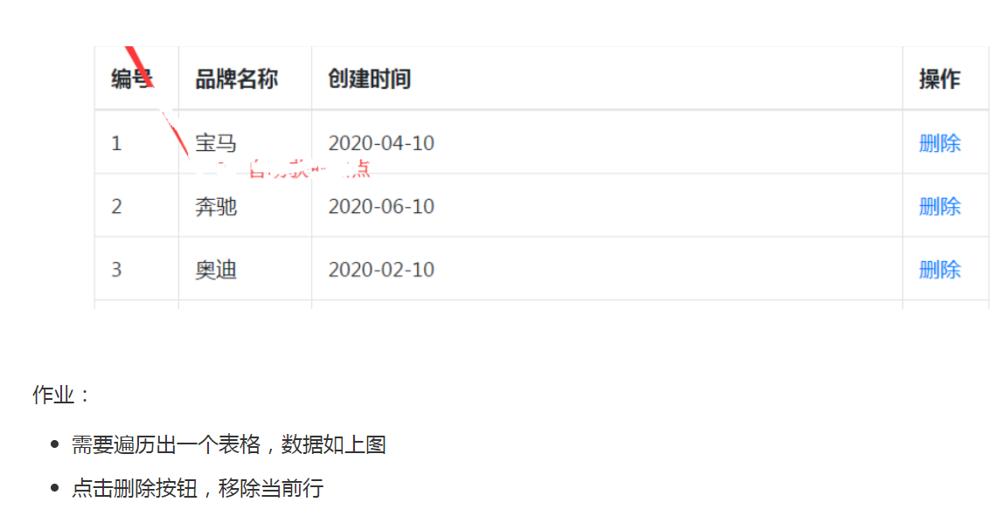

## VUE基础-day02

### 01-每日回顾

vue是什么

- 它就js框架，有自己的开发规则。

vue做什么

- 适合做SPA类型的系统

vue核心

- 数据驱动视图，MVVM模式，组件化开发

vue的配置选项

- el   指定vue实例管理的视图容器
- data   声明响应式数据
- methods   定义函数

术语

- 插值表达式 `{{}}`
- 指令  `v-*` 的属性

指令

- v-text    更新替换标签内容，文本
- v-html    更新替换标签内容，html
- v-show  显示隐藏
- v-if  移除创建
- v-on  绑定事件
- v-bind  绑定属性
- v-for  进行遍历




准备静态页面：

```html
<!DOCTYPE html>
<html lang="en">
<head>
  <meta charset="UTF-8">
  <meta name="viewport" content="width=device-width, initial-scale=1.0">
  <title>案例</title>
  <link rel="stylesheet" href="./bootstrap.min.css">
</head>
<body>
  <div id="app" class="container" style="padding-top: 100px;">
    <table class="table table-bordered">
      <thead>
        <tr>
          <th>编号</th>
          <th>品牌名称</th>
          <th>创建时间</th>
          <th>操作</th>
        </tr>
      </thead>
      <tbody>
        <tr>
          <td>1</td>
          <td>宝马</td>
          <td>2010-10-10 10:10:10</td>
          <td>
            <a href="#">删除</a>
          </td>
        </tr>
      </tbody>
    </table>
  </div>
  <script src="./vue.js"></script>
</body>
</html>
```


### 02-案例-渲染列表

实现的大致步骤：

- 准备表格所需数据
- 使用v-for指令进行遍历 （tbody--->tr）

落地的代码：

```html
<!DOCTYPE html>
<html lang="en">
<head>
  <meta charset="UTF-8">
  <meta name="viewport" content="width=device-width, initial-scale=1.0">
  <title>案例</title>
  <link rel="stylesheet" href="./bootstrap.min.css">
</head>
<body>
  <div id="app" class="container" style="padding-top: 100px;">
    <table class="table table-bordered">
      <thead>
        <tr>
          <th>编号</th>
          <th>品牌名称</th>
          <th>创建时间</th>
          <th>操作</th>
        </tr>
      </thead>
      <tbody>
        <!-- v-for="每个选项变量名称 in  data数据中的数组" -->
        <tr v-for="brand in brandList" :key="brand.id">
          <td>{{brand.id}}</td>
          <td>{{brand.brandName}}</td>
          <td>{{brand.createTime}}</td>
          <td>
            <a href="#">删除</a>
          </td>
        </tr>
      </tbody>
    </table>
  </div>
  <script src="./vue.js"></script>
  <script>
    // 初始化
    const vm = new Vue({
      el: '#app',
      data: {
        // 品牌列表数据
        brandList: [
          {id:1,brandName:'宝马',createTime:'2020-06-01 12:12:12'},
          {id:2,brandName:'宝骏',createTime:'2021-06-01 12:12:12'},
          {id:3,brandName:'保时捷',createTime:'2020-06-01 12:12:12'},
          {id:4,brandName:'奥迪',createTime:'2025-06-01 12:12:12'}
        ]
      }
    })
  </script>
</body>
</html>
```


### 03-案例-完成删除

实现的大致步骤：

- 绑定删除按钮的点击事件
- 但是 删除是一个A标签  点击的时候默认发生跳转  需要阻止默认行为
- 指定一个处理函数，在函数中删除数组中对应的数据即可
  - **数据驱动视图**
- 在点击的时候给函数传入ID，根据ID找到索引，根据索引移除数组中的数据。
- 当列表无数据时，需要提示暂无数据。

落地代码：

- 绑定事件

```html
          <td>
            <a href="#" @click.prevent="delBrand(brand.id)">删除</a>
          </td>
```

- 指定函数

```js
      methods: {
        // 删除品牌
        delBrand (id) {
          // 1. 根据ID找到索引
          // 完整写法
          //const index = this.brandList.findIndex(function(item){
          //  return item.id === id
          //})
          const index = this.brandList.findIndex(item=>item.id===id)
          // 2. 根据索引删除数据
          this.brandList.splice(index,1)
        }
      }
```

- 处理无数据

```html
        <!-- 条件渲染使用v-if  显示的条件：数组没有长度 -->
        <tr v-if="brandList.length===0">
          <td colspan="4" style="text-align: center;">暂无数据</td>
        </tr>
```


额外知识：

- 概念：事件修饰符
- 例如：
  - 绑定的事件的时候阻止默认行为  `@click.prevent="处理函数"`
  - 绑定的事件的时候阻止默认冒泡  `@click.stop="处理函数"`


### 04-指令-v-bind绑定class

> 目标：通过数据的方式去操作class中的类名

作用：操作类名

想法：class属性是由多个类组成，使用对象或者数组


绑定对象：

- 语法：`<div :class="{类名:是否添加该类名,...}"></div>`
- 例如：`<div :class="{btn:true,red:false}"></div>`

```html
    <style>
      .bg{
        background: pink;
      }
      .red {
        color: red;
      }
    </style>
  </head>
  <body>
    <div id="app">
      <!-- 基本写法 -->
      <!-- <div :class="{bg:false,red:false}">使用对象操作类名</div> -->
      <!-- 通过数据来控制 单独控制-->
      <!-- <div :class="{bg:hasBg,red:hasRed}">使用对象操作类名</div> -->
      <!-- 通过数据来控制 完整控制 -->
      <button @click="classObject.bg=true">加bg</button>
      <button @click="classObject.red=true">加red</button>
      <div :class="classObject">使用对象操作类名</div>
    </div>
    <script src="./vue.js"></script>
    <script>
      const vm = new Vue({
        el: '#app',
        data: {
          // hasBg: false,
          // hasRed: false
          classObject: {
            bg: false,
            red: false
          }
        },
        methods: {}
      })
    </script>
  </body>
```


绑定数组：

- 语法：`<div :class="['类名1','类名2']"></div>`
- 例子：`<div :class="['bg','red']"></div>`

```html
      <!-- 基本写法 -->
      <!-- <div :class="['bg','red']">使用数组操作类名</div> -->
      <button @click="classArray.push('bg')">加bg</button>
      <button @click="classArray.push('red')">加red</button>
      <div :class="classArray">使用数组操作类名</div>
```

```diff
        data: {
          // hasBg: false,
          // hasRed: false
          classObject: {
            bg: false,
            red: false
          },
+          classArray: []
        },
```


补充：

- 如果既有 `class`  又有 `:class`  是什么效果
- class是默认类名，：class产生的类名会进行合并。


总结：

- v-bind绑定class可以使用对象可以使用数组进行操作。
- `:class="{类名：是否加类名}"`
- `:class="['类名']"`


### 05-指令-v-bind绑定style


### 06-指令-v-model


### 07-指令-v-cloak


### 08-指令-v-once


###  09-案例-添加品牌


### 10-案例-梳理其它功能


### 11-vue定义过滤器


### 12-vue操作dom


### 13-vue自定义指令


