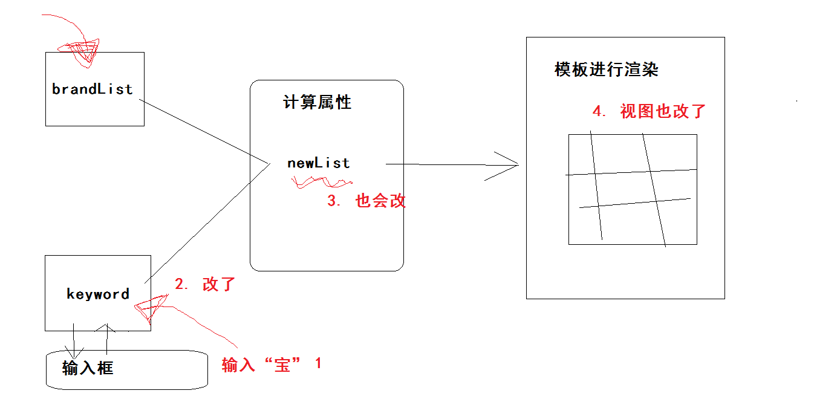
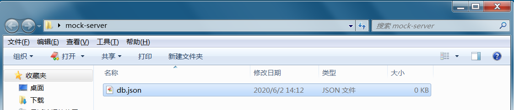
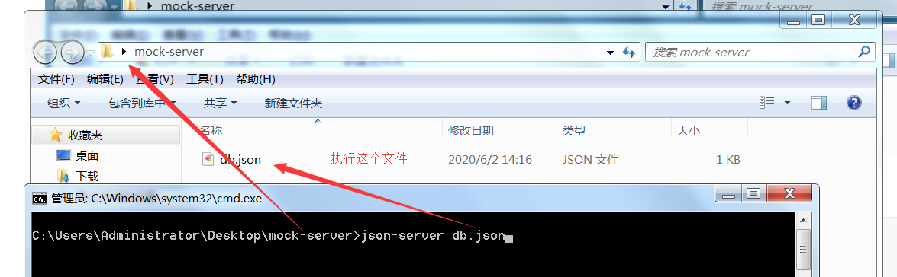
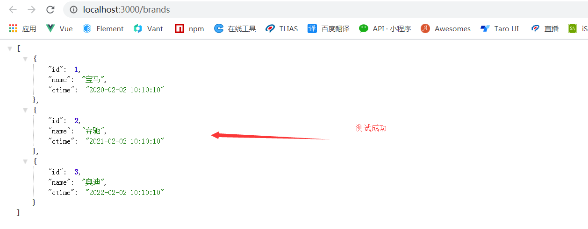

## VUE基础-day03


### 01-每日回顾

- v-bind指令
  - class属性
    - 对象 `:class="{'类名':'是否使用这个类名',...}"`
    - 数组 `:class="['类名1','类名',...]"`
  - style属性
    - 对象 `:style="{fontSize:'100px',...}"`
    - 数组 `:style="[{css属性},{},...]"`
- v-model指令
  - 语法糖（某些代码简写）原理
    - `:value`  `@input`   关键字
  - 其他表单元素的双向绑定
- v-cloak指令
  - 插值表达式闪烁问题
  - 配合自己写一段样式来实现
- v-once
  - 只渲染一次
- vue的过滤器
  - 转换输出数据格式的
  - 全局 `Vue.filter('过滤器名称',处理函数)`
  - 局部 `new Vue({filters:{过滤器名称:处理函数}})`
- vue中获取dom
  - ref属性标识容器
  - 通过$refs来获取


### 02-每日作业

- 实现时间格式转换
- 实现自动获取焦点

```diff
+    <input type="text" class="form-control" placeholder="输入搜索关键字" style="margin-bottom: 15px;width:195px">
    <table class="table table-bordered ">
```


使用过滤器来实现时间格式转换：

```js
    // 过滤器
    Vue.filter('formatDate',(val)=>{
      // val 是使用过滤器的时候，管道符前的js表达式的执行结果
      // val 可能是字符串 Date对象，转换成date对象
      const myDate = new Date(val)
      const y = myDate.getFullYear()
      const m = String(myDate.getMonth() + 1).padStart(2,0)
      const d = String(myDate.getDate()).padStart(2,0)
      const hh = String(myDate.getHours()).padStart(2,0)
      const mm = String(myDate.getMinutes()).padStart(2,0)
      const ss = String(myDate.getSeconds()).padStart(2,0)
      return `${y}-${m}-${d} ${hh}:${mm}:${ss}`
    })
```

```html
<td>{{brand.createTime|formatDate}}</td>
```


使用ref来实现自动获取焦点

- 有个H5属性 `autofocus`  即可自动获取焦点.
  - 但是模板会被vue解析，所以不会自动获取焦点。
- 可以在模板解析后，通过dom去获取焦点。
  - 获取焦点 `inputDom.focus()`  

```html
<input ref="inputDom" type="text" class="form-control" 
```

```js
    // window.onload = function(){}  等页面资源（css,js,img...）全部加载完毕执行
    // $(function(){}) 等页面文档（html结构）加载完成

    // 等模板解析完成，获取焦点
    setTimeout(()=>{
      // 意思：等所有代码执行完毕后，在来执行定时器中的代码
      vm.$refs.inputDom.focus()
    },0)
    // 不建议这种方式，不规范,投机取巧。
    // 补充：后面会学习vue的模板渲染完成的回调函数。
```


### 03-自定义指令

> 目标：vue提供的指令是有限的，实现的功能有限，尝试自己封装指令（自定义指令）

作用：

- 通过vue来封装指令（directive），从而去扩展标签原本的功能。

语法：

- 全局指令
  - 语法：`Vue.directive(指令名称,指令的配置对象)`
  - 指令名称：定义的时候不需要`v-`，但是使用的时候加上`v-`
  - 指令的配置对象：{inserted(el){}}  等使用该指令的元素渲染完毕后（dom生成后）执行
    - 在dom生成后才可为该dom扩展功能
    - el 就是使用指令的dom对象
- 局部指令
  - 语法：`new Vue({directives:{指令名称:指令的配置对象,...}})`
  - 指令名称：定义的时候不需要`v-`，但是使用的时候加上`v-`
  - 指令的配置对象：{inserted(el){}}  等使用该指令的元素渲染完毕后（dom生成后）执行
    - 在dom生成后才可为该dom扩展功能
    - el 就是使用指令的dom对象

代码：

```html
<!DOCTYPE html>
<html>
  <head>
    <meta charset="UTF-8" />
    <meta name="viewport" content="width=device-width, initial-scale=1.0" />
    <title></title>
  </head>
  <body>
    <div id="app">
      <!-- 需求：v-focus指令来为该input标签实现自动获取焦点功能 -->
      <input type="text" v-focus="{h:100,w:100}">
    </div>
    <script src="./vue.js"></script>
    <script>
      // 全局指令
      // Vue.directive('focus',{
      //   // inserted 函数使用该指令的元素渲染完毕后执行
      //   inserted (el) {
      //     // el 使用该指令的DOM
      //     // 获取焦点
      //     // 对dom扩展任意功能
      //     el.style.height = '200px'
      //     el.focus()
      //   }
      // })

      const vm = new Vue({
        el: '#app',
        data: {},
        methods: {},
        // 局部 定义自定义指令
        directives: {
          // 属性名：指令的名称
          // 属性值：指令配置对象
          focus: {
            inserted (el, binding) {
              // binding 指令的信息对象
              // 其中有一个 value 就是指令的值
              el.style.width = binding.value.w + 'px'
              el.style.height = binding.value.h + 'px'
              el.focus()
            }
          }
        }
      })
    </script>
  </body>
</html>
```

补充：

- 指令的参数怎么接收 `inserted(el,binding){}`  binding就是指令信息


### 04-计算属性

> 目标：掌握通过计算属性来降低模板复杂度，提高模板的清晰度，可读性。

作用：

- 根据data当中的数据，经过一定的逻辑处理，得到一项新数据（计算属性）。
- 当data中的数据发生变化的时候，计算属性也会更新。
- 计算属性也是响应式数据，改变的时候也会驱动视图的更新。
- 当多次获取计算属性的时候，处理逻辑不会重新执行，因为有缓存。

定义：

- 语法：`new Vue({computed:{ 书写计算属性 }})`
- 书写计算属性：
  - `myMsg () { // 处理逻辑  return ‘处理后的数据’ }`
- 使用：和data中的数据一致

代码：

```html
<!DOCTYPE html>
<html>
  <head>
    <meta charset="UTF-8" />
    <meta name="viewport" content="width=device-width, initial-scale=1.0" />
    <title></title>
  </head>
  <body>
    <div id="app">
      <h1>{{message}}</h1>
      <!-- 逻辑复杂，可读性差，违背初心（使用简单的js表达式） -->
      <h1>{{ message.split('').reverse().join('') }}</h1>
      <!-- 通过计算属性来优化 -->
      <hr>
      <h1>{{reverseMsg}}</h1>
    </div>
    <script src="./vue.js"></script>
    <script>
      const vm = new Vue({
        el: '#app',
        // 数据
        data: {
          message: 'hi vue'
        },
        methods: {},
        // vue的配置选项：computed
        // 计算属性
        computed: {
          // 属性名 计算属性的名称
          // 属性值 计算属性的处理函数
          // reverseMsg : function () {
          reverseMsg () {
            // 依赖data中的数据，进行一定的逻辑处理，得到一个新数据
            const newMsg = this.message.split('').reverse().join('')
            // 必须将新数据返回出去
            return newMsg
          }
          // reverseMsg 就是数据名称，在模板中使用data中数据一致
        }
      })
    </script>
  </body>
</html>
```


总结：

- 使用场景：当你依赖data里面的数据，经过较为复杂的逻辑处理，得到一个新的数据，此时可以使用计算属性来实现。


### 05-computed和methods区别

> 目的：指定计算属性和函数的区别，知道计算属性的有优点：缓存

```html
<!DOCTYPE html>
<html>
  <head>
    <meta charset="UTF-8" />
    <meta name="viewport" content="width=device-width, initial-scale=1.0" />
    <title></title>
  </head>
  <body>
    <div id="app">
      <h1>{{reverseFn()}}</h1>
      <h1>{{reverseFn()}}</h1>
      <h1>{{reverseFn()}}</h1>
      <h1>{{reverseMsg}}</h1>
      <h1>{{reverseMsg}}</h1>
      <h1>{{reverseMsg}}</h1>
    </div>
    <script src="./vue.js"></script>
    <script>
      const vm = new Vue({
        el: '#app',
        data: {
          message: 'hi vue'
        },
        methods: {
          // 反转字符的函数  模板中使用{{reverseFn()}}
          reverseFn () {
            console.log('reverseFn')
            return this.message.split('').reverse().join('')
          }
          // 每使用一次，会调用一次函数，重新执行内部逻辑，得到数据
        },
        computed: {
          // 反转字符计算属性 模板中使用{{reverseMsg}}
          reverseMsg () {
            console.log('reverseMsg')
            return this.message.split('').reverse().join('')
          }
          // 当多次调用的时候，之后执行一次逻辑，或走缓存
        }
      })
    </script>
  </body>
</html>
```

总结：

- 函数也可以实现数据逻辑处理得到新数据，但是多没使用一次执行一次逻辑，性能不优。
- 计算属性，在多次使用的时候，会走缓存，性能更好。
- 将来对数据进行（较为复杂）逻辑处理，建议使用计算属性。


### 06-案例-完善功能

- 自动获取焦点（自定义指令）

```html
<input v-autofocus 
```

```js
    // 指令
    Vue.directive('autofocus',{
      inserted (el) {
        el.focus()
      }
    })
```

- 筛选品牌功能（计算属性）

思路：

1、在关键字输入框输入内容的时候进行筛选

2、获取输入框中的关键字 使用v-model即可

3、那么需要在data中声明数据接收输入框内容  `{data:{brandList,keyword}}`

4、依赖 brandList 和 keyword 经过筛选，得到一个新的数组（筛选结果）

- 根据keyword去brandList中查询，当brandList中的每一项的品牌名字包含keyword就符合条件

5、通过计算属性来实现

代码：

```html
<!DOCTYPE html>
<html lang="en">
<head>
  <meta charset="UTF-8">
  <meta name="viewport" content="width=device-width, initial-scale=1.0">
  <title>案例</title>
  <link rel="stylesheet" href="./bootstrap.min.css">
</head>
<body>
  <div id="app" class="container" style="padding-top: 100px;">
    <input v-model="keyword" v-autofocus type="text" class="form-control" placeholder="输入搜索关键字" style="margin-bottom: 15px;width:195px">
    <table class="table table-bordered ">
      <thead>
        <tr>
          <th>编号</th>
          <th>品牌名称</th>
          <th>创建时间</th>
          <th>操作</th>
        </tr>
      </thead>
      <tbody>
        <!-- v-for="每个选项变量名称 in  data数据中的数组" -->
        <tr v-for="brand in newList" :key="brand.id">
          <td>{{brand.id}}</td>
          <td>{{brand.brandName}}</td>
          <td>{{brand.createTime|formatDate}}</td>
          <td>
            <a href="#" @click.prevent="delBrand(brand.id)">删除</a>
          </td>
        </tr>
        <!-- 条件渲染使用v-if  显示的条件：数组没有长度 -->
        <tr v-if="newList.length===0">
          <td colspan="4" style="text-align: center;">暂无数据</td>
        </tr>
      </tbody>
    </table>
    <!-- 表单 -->
    <form class="form-inline" @submit.prevent="addBrand()">
      <div class="form-group" style="margin-right: 10px;">
        <input v-model="brandName" type="text" class="form-control" placeholder="请输入品牌">
      </div>
      <!-- submit点击会触发form的默认提交行为，form安装action进行跳转 -->
      <button type="submit" class="btn btn-primary">添加品牌</button>
    </form>
  </div>
  <script src="./vue.js"></script>
  <script>

    // 过滤器
    Vue.filter('formatDate',(val)=>{
      // val 是使用过滤器的时候，管道符前的js表达式的执行结果
      // val 可能是字符串 Date对象，转换成date对象
      const myDate = new Date(val)
      const y = myDate.getFullYear()
      const m = String(myDate.getMonth() + 1).padStart(2,0)
      const d = String(myDate.getDate()).padStart(2,0)
      const hh = String(myDate.getHours()).padStart(2,0)
      const mm = String(myDate.getMinutes()).padStart(2,0)
      const ss = String(myDate.getSeconds()).padStart(2,0)
      return `${y}-${m}-${d} ${hh}:${mm}:${ss}`
    })

    // 指令
    Vue.directive('autofocus',{
      inserted (el) {
        el.focus()
      }
    })

    // 初始化
    const vm = new Vue({
      el: '#app',
      data: {
        // 品牌列表数据
        brandList: [
          { id: 1, brandName: '宝马', createTime: '2020-06-01 12:12:12' },
          { id: 2, brandName: '宝骏', createTime: '2021-06-01 12:12:12' },
          { id: 3, brandName: '保时捷', createTime: '2020/06/01 12:12:12' },
          { id: 4, brandName: '奥迪', createTime: new Date() }
        ],
        // 输入的品牌
        brandName: '',
        // 关键字
        keyword: ''
      },
      computed: {
        // 根据 keyword brandList 得到新数组
        newList () {
          // // 这里才是vue实例
          // const _this = this
          // const list = this.brandList.filter(function(item){
          //   // 拿出item中的brandName去匹配keyword
          //   // 如果包含返回 true 反之返回false
          //   // 该回调函数返回 true 将当前的item追加到新数组
          //   return item.brandName.includes(_this.keyword)
          // })
          // return list
          // this.keyword 默认是 '' 那么会查询到所有数据
          return this.brandList.filter(item=>item.brandName.includes(this.keyword))
        }
      },
      methods: {
        // 删除品牌
        delBrand(id) {
          // 1. 根据ID找到索引
          const index = this.brandList.findIndex(item => item.id === id)
          // 2. 根据索引删除数据
          this.brandList.splice(index, 1)
        },
        // 添加品牌
        addBrand() {
          // 校验输入的内容
          if (!this.brandName.trim()) return alert('请输入品牌名称')
          // 添加逻辑
          // 生成ID
          // 1. 如果此时数组有长度，去除最后一条数据的ID累加1即可
          // 2. 如果此时数组无长度，ID默认为1
          const id = this.brandList.length ? this.brandList[this.brandList.length - 1].id + 1 : 1
          this.brandList.push({
            id,
            brandName: this.brandName,
            createTime: new Date()
          })
          // 修改了数组，驱动视图更新，列表添加完毕
          // 清空输入内容
          this.brandName = ''
        }
      }
    })
  </script>
</body>

</html>
```

画图分析实现：




### 07-工具-json-server

> 目标：能够运用json-server模拟接口

场景：

- 做的是前后端分离的项目，前端需要依赖后台的接口
- 如果后台的接口没有开发好，前端的工作就不用继续了吗？

作用：

- json-server可以快速的模拟接口
- 它是一个基于nodejs的命令行工具，例如：`nodemon`

安装：

- `npm i json-server -g`   全局安装

使用的基本步骤：

- 新建一个文件夹，名字随意


- 进入文件夹，创建一个json文件，名字随意



- 在json文件中写入内容

```json
{
  "brands": [
    {"id":1,"name":"宝马","ctime":"2020-02-02 10:10:10"},
    {"id":2,"name":"奔驰","ctime":"2021-02-02 10:10:10"},
    {"id":3,"name":"奥迪","ctime":"2022-02-02 10:10:10"}
  ]
}
```

- 在当前文件夹，执行启动json-server的服务



- 成功的日志


- 访问  http://localhost:3000/brands 测试



- 其实增删查改，条件查询都已实现。


注意事项：

- 不能关闭命令行窗口
- id一定是数字，这样id才能自增


### 08-接口规则-RESTful

> 目标：了解一种接口定义规范resetful

接口规范：如何定义接口地址，请求方式，传参方式，对应不同的请求操作行为。

具体规则：

| 接口地址    | 请求方式 | 操作行为                                         |
| ----------- | -------- | ------------------------------------------------ |
| /brands     | GET      | 查询所有列表                                     |
| /brands/:id | GET      | 查询单个详情 `/brands/1`                         |
| /brands     | POST     | 添加，提交的参数在请求体                         |
| /brands/:id | DELETE   | 删除 `/brands/1`                                 |
| /brands/:id | PUT      | 修改 `/brands/1`  + 请求体{name,cTime}  全部修改 |
| /brands/:id | PATCH    | 修改 `/brands/1`  + 请求体{name}  个别修改       |

这个表格可以作为接口调用的参考。


### 09-插件-axios

> 目标：通过axios插件调用后台接口

axios是什么：

- 是一个js插件，专注于网络通信（前端的xhr）。
- 它可以在前端浏览器使用，也可以在后台nodejs环境中使用。
- 如果在前端使用它是基于：xhr + promise 实现的

axios的下载：

- 文档  https://www.kancloud.cn/yunye/axios/234845 
- 资源  https://unpkg.com/axios/dist/axios.min.js

axios的使用：

- 查询所有

- 查询单个

- 添加操作

- 删除操作

- 修改操作

```html
<!DOCTYPE html>
<html lang="en">

<head>
  <meta charset="UTF-8">
  <meta name="viewport" content="width=device-width, initial-scale=1.0">
  <title>Document</title>
</head>

<body>

  <script src="./axios.min.js"></script>
  <script>
      // - 查询所有
      // axios.get('http://localhost:3000/brands').then(res=>{
      //   // res 响应报文对象（响应状态行+响应头+响应主体）
      //   // res.data 就是响应主体（返回的数据）
      //   console.log(res.data)
      // }).catch(err=>{
      //   // 错误对象
      //   console.log(err)
      // })


      // - 查询单个
      // axios.get('http://localhost:3000/brands/2').then(res=>{
      //   console.log(res.data)
      // }).catch(err=>{
      //   console.log(err)
      // })


      // - 添加操作
      // 第二个参数：请求体传参对象
      // axios.post('http://localhost:3000/brands',{
      //   name: '奥拓',
      //   cTime: new Date()
      // }).then(res=>{
      //   console.log('添加成功')
      // })


      // - 删除操作
      // axios.delete('http://localhost:3000/brands/4').then(res=>{
      //   console.log('删除成功')
      // })


      // - 修改操作
      // 第二个参数：请求体传参对象
      // axios.patch('http://localhost:3000/brands/3',{
      //   name: '奥拓'
      // }).then(res=>{
      //   console.log('修改成功')
      // })

      // axios.put('http://localhost:3000/brands/3',{
      //   name: '奥迪',
      //   cTime: new Date()
      // }).then(res=>{
      //   console.log('修改成功')
      // })

      // - 带查询参数
      // 1. 自己手动在地址栏拼接?后的键值对  ?id=2&name=宝马
      // 2. 可以传对象提交多个筛选条件 
      // 3. get()中第二个参数可以用来提交参数对象  {params:{更多筛选条件}}


      // json-server提供模糊查询  字段_like
      axios.get('http://localhost:3000/brands',{
        params:{
          name_like: '奥'
        }
      }).then(res=>{
        console.log(res.data)
      }).catch(err=>{
        console.log(err)
      })

  </script>
</body>

</html>
```


### 10-接口版案例-列表渲染

实现的大致步骤：

- 准备好静态页面
- 初始化vue实例
- 在vue**实例创建**完毕后，发查询所有的请求
- 如果请求成功，渲染列表
  - 在data中声明列表数据
  - 获取后台返回的数据  给data中声明的数据 赋值（数据驱动视图）

落地的代码：

- 准备静态页面

```html
<!DOCTYPE html>
<html lang="en">
<head>
  <meta charset="UTF-8">
  <meta name="viewport" content="width=device-width, initial-scale=1.0">
  <title>案例</title>
  <link rel="stylesheet" href="./bootstrap.min.css">
</head>
<body>
  <div id="app" class="container" style="padding-top: 100px;">
    <input type="text" class="form-control" placeholder="输入搜索关键字" style="margin-bottom: 15px;width:195px">
    <table class="table table-bordered ">
      <thead>
        <tr>
          <th>编号</th>
          <th>品牌名称</th>
          <th>创建时间</th>
          <th>操作</th>
        </tr>
      </thead>
      <tbody>
        <tr>
          <td>1</td>
          <td>xxx</td>
          <td>xxx</td>
          <td><a href="#">删除</a></td>
        </tr>
      </tbody>
    </table>
    <!-- 表单 -->
    <form class="form-inline">
      <div class="form-group" style="margin-right: 10px;">
        <input type="text" class="form-control" placeholder="请输入品牌">
      </div>
      <!-- submit点击会触发form的默认提交行为，form安装action进行跳转 -->
      <button type="submit" class="btn btn-primary">添加品牌</button>
    </form>
  </div>
  <script src="./vue.js"></script>
  <script>

  </script>
</body>

</html>
```

- 初始化vue实例，created中获取数据，修改数据，渲染页面

```html
  <script src="./axios.min.js"></script>
  <script>
    const vm = new Vue({
      el: '#app',
      data: {
        // 列表数据
        brandList: []
      },
      // vue的配置选项：created 它是一个函数，vue实例完毕后执行
      created () {
        this.getBrands()
      },
      methods: {
        // 发起获取品牌列表的请求
        getBrands () {
          axios.get('http://localhost:3000/brands').then(res=>{
            // 请求成功 
            // res.data 得到的请求列表
            this.brandList = res.data
          })
        }
      }
    })
  </script>
```

```html
      <tbody>
        <tr v-for="item in brandList" :key="item.id">
          <td>{{item.id}}</td>
          <td>{{item.name}}</td>
          <td>{{item.ctime}}</td>
          <td><a href="#">删除</a></td>
        </tr>
        <tr v-if="brandList.length===0">
          <td colspan="4" style="text-align: center;">暂无数据</td>
        </tr>
      </tbody>
```


总结：created函数在vue实例创建完毕后执行，在此处发请求获取初始化需要的数据。


### 11-接口版案例-删除品牌

实现的大致步骤：

- 绑定删除按钮的点击事件，阻止默认行为
- 在指定的事件函数中
  - 绑定函数的时候传入ID
  - 弹出一个确认删除的对话框
  - 点击确认后发删除请求
- 当删除成功后，需要更新当前列表
  - 从后台拿到最新的列表数据，重新赋值brandList即可

落地的代码：

```html
          <td><a href="#" @click.prevent="delBrand(item.id)">删除</a></td>
```

```js
        // 删除品牌
        delBrand (id) {
          if (confirm('您确认删除该品牌吗？')) {
            axios.delete(`http://localhost:3000/brands/${id}`).then(res=>{
              this.getBrands()
            })
          }
        }
```


### 12-接口版案例-添加品牌


### 13-接口版案例-搜索品牌


