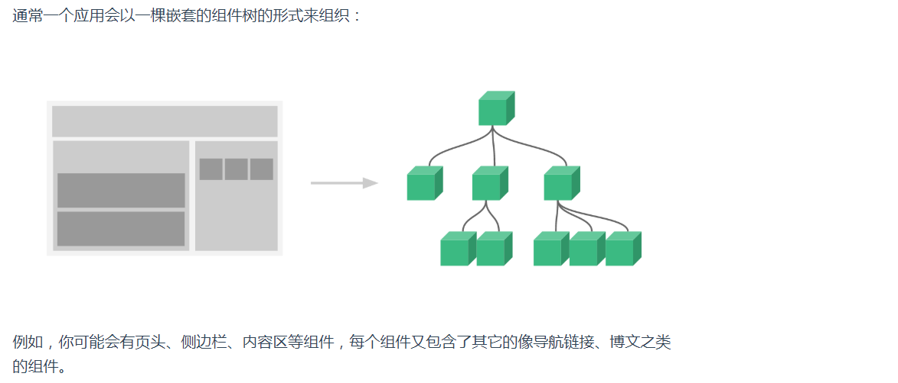
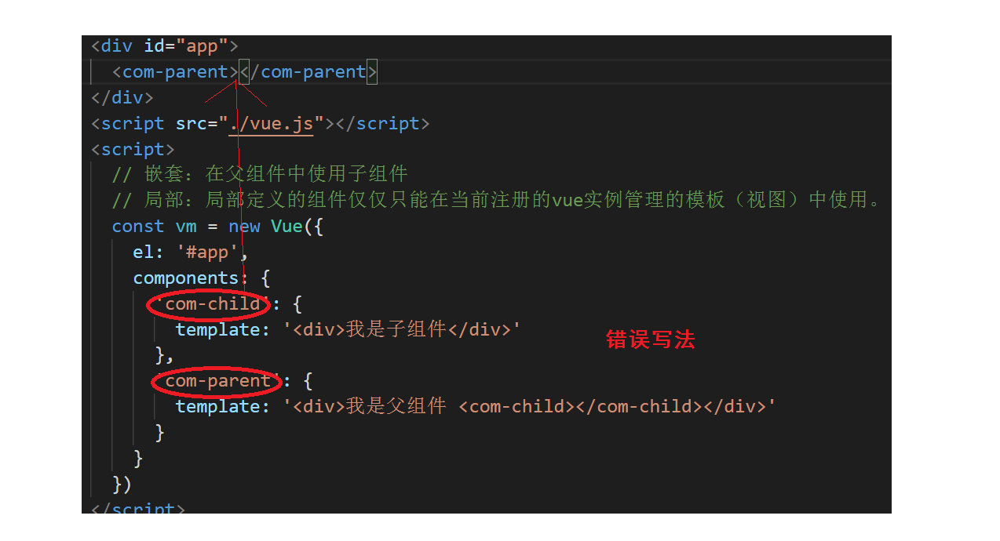
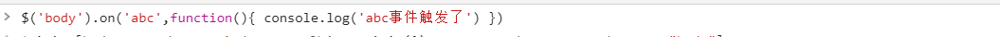
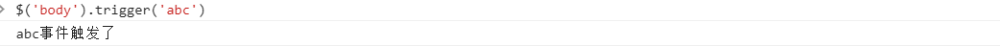
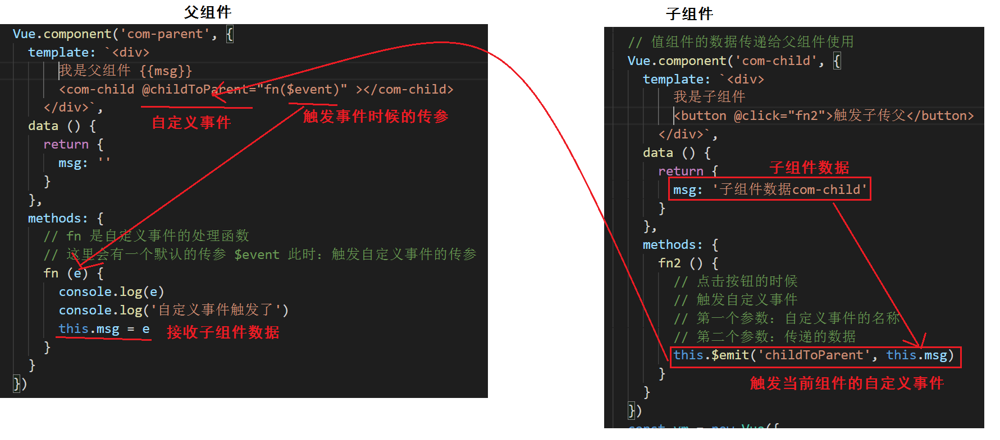

## VUE基础-day04


### 01-每日回顾

- 计算属性(为了得到数据)

  - 场景：你想依赖data里面的数据，经过逻辑处理，得到一项行新的数据
  - 语法：`new Vue({computed:{'计算属性名称':处理函数(){ 返回的就是新数据 }}})`

- 自定义指令

  - 场景：你想扩展标签的原有的功能
  - 全局：`Vue.directive('指令名称',指令配置对象{ inserted(){ 扩展标签功能 } })`
  - 局部：`new Vue({ directives:{ '指令名称':指令配置对象{ inserted(){ 扩展标签功能 }   } })`

- 侦听器（监听数据变化）

  - 场景：当你数据变化的时候，需要做异步操作或开销较大操作的时候。
  - 补充：其实只要想监听数据的变化去做其他事情，都可以使用侦听器。
  - 语法： `new Vue({watch:{ 'data中数据的字段名称',处理函数 }})`

- 接口开发

  - json-server

    - 模拟接口的一个基于nodejs命令行工具
    - 安装后在 json 中定义接口相关的数据
    - 启动接口服务即可

  - restful

    - get    查询
    - post   添加
    - delete  删除
    - put   全部修改
    - patch   局部修改

  - axios

    - axios.get()   键值对传参   get的第二个参数 `{params:{//对象数据}}`
    - axios.post()   请求体传参   post的第二个参数 {//请求体对象}
    - axios.delete()
    - axios.put()
    - axios.patch()
    - 综合的请求函数  axios({ // 请求配置对象 })
      - method  请求类型
      - url 请求地址
      - params  键值对参数对象
      - data  请求体参数对象
      - headers 请求头参数对象

    ```js
    axios({
      method: 'post',
      url: '接口地址',
      data: { /*请求体传参*/ },
      params: {  /*请求体传参*/ },
      headers: {
        'Content-Type': 'application/json'
      }
    })
    ```

- 接口-品牌列表案例

  - 列表
  - 删除
  - 添加
  - 搜索


###  02-★组件-概念

> 目标：知道组件的一些概念，组件优点



概念：

- JS模块：对一个逻辑的封装，说白了就是一个js文件（模块）

- vue组件：把网页分成若干块，针对界面功能的封装，一个组件包含（HTML,CSS,JS）
- vue组件也是一个vue实例，在定义组件的时候可以使用`vue的配置选项` ,例如你可以使用 data method ... 这样的配置选项，有一个选项不能使用 `el` 

优点：

- 组件与组件之间是相互独立的，拥有自己的数据data、函数methods...，可维护性提高。
- 可复用


### 03-★组件-体验

> 目的：体验组件的好处。

- 三个一致的功能，点击一个按钮可以累加10，显示累加的结果。

不使用组件：

```html
<!DOCTYPE html>
<html>
  <head>
    <meta charset="UTF-8" />
    <meta name="viewport" content="width=device-width, initial-scale=1.0" />
    <title></title>
  </head>
  <body>
    <div id="app">
      <!-- 累加10的功能，三个一样的 -->
      <div>结果：{{count}} <button @click="add()">累加10</button></div>
      <div>结果：{{count1}} <button @click="add1()">累加10</button></div>
      <div>结果：{{count2}} <button @click="add2()">累加10</button></div>
    </div>
    <script src="./vue.js"></script>
    <script>
      const vm = new Vue({
        el: '#app',
        data: {
          count: 0,
          count1: 0,
          count2: 0
        },
        methods: {
          add () {
            this.count = this.count + 10
          },
          add1 () {
            this.count1 = this.count1 + 10
          },
          add2 () {
            this.count2 = this.count2 + 10
          }
        }
      })
    </script>
  </body>
</html>
```

使用组件：

```html
    <div id="app">
      <btn-add></btn-add>
      <btn-add></btn-add>
      <btn-add></btn-add>
    </div>
    <script src="./vue.js"></script>
    <script>

      // 定义组件
      Vue.component('btn-add',{
        template: `<div>结果：{{count}} <button @click="add()">累加10</button></div>`,
        data () {
          return {
            count: 0
          }
        },
        methods: {
          add () {
            this.count = this.count + 10
          }
        }
      })

      const vm = new Vue({
        el: '#app'
      })
    </script>
```


###  04-★组件-全局注册

> 目标：掌握全局组件注册的写法

全局注册的意思：在任何vue实例下都可以使用。

具体语法：

- 定义 `Vue.component(组件名称,组件配置对象)`

- 组件配置对象 和  vue实例配置对象  是几乎一样，没有el选项。

- template选项，声明组件结构的（组件自己的模板）。有且只有一个根标签。必须有这个选项

- data选项，必须指定一个函数，函数的返回对象是用来声明数据的。

使用组件：

- 在vue实例管理的视图中#app，把 组件名字 当中一个标签来使用，组件的名字不能用原生的标签来命名。
- 例如：div span a  article  footer header section ... 原生标签。

演示代码：

```html
<!DOCTYPE html>
<html>
  <head>
    <meta charset="UTF-8" />
    <meta name="viewport" content="width=device-width, initial-scale=1.0" />
    <title></title>
  </head>
  <body>
    <div id="app">
      <btn-add></btn-add>
    </div>
    <hr>
    <div id="app2">
      <btn-add></btn-add>
    </div>
    <script src="./vue.js"></script>
    <script>

      // 全局注册
      Vue.component('btn-add',{
        // 这是一个字符串，模板字符的原因是：可换html的结构清晰些
        // 细节：需要有且只有一个根标签
        template: `<div>
            结果：{{count}} 
            <button @click="add()">累加</button>
          </div>`,
        // 在组件中data必须是一个函数，返回的对象中来声明数据
        data () {
          return {
            count: 0
          }
        },
        methods: {
          add () {
            this.count ++
          }
        }
      })

      const vm = new Vue({
        el: '#app',
      })
      const vm2 = new Vue({
        el: '#app2',
      })
    </script>
  </body>
</html>
```


###  05-★组件-局部注册

> 目标：掌握局部组件注册的写法

局部注册的意思：仅仅在注册组件的当前vue实例管理的视图中才可以使用。

具体语法：

- 语法：`new Vue({ components:{组件的名字:组件配置对象} })`
- 组件配置对象 和  vue实例配置对象  是几乎一样，没有el选项。
- template选项，声明组件结构的（组件自己的模板）。有且只有一个根标签。必须有这个选项

- data选项，必须指定一个函数，函数的返回对象是用来声明数据的。

使用组件：

- 在vue实例管理的视图中#app，把 组件名字 当中一个标签来使用，组件的名字不能用原生的标签来命名。
- 例如：div span a  article  footer header section ... 原生标签。

演示代码：

```html
<!DOCTYPE html>
<html>
  <head>
    <meta charset="UTF-8" />
    <meta name="viewport" content="width=device-width, initial-scale=1.0" />
    <title></title>
  </head>
  <body>
    <div id="app">
      <btn-add></btn-add>
    </div>
    <div id="app2">
      <btn-add></btn-add>
    </div>
    <script src="./vue.js"></script>
    <script>
      const vm = new Vue({
        el: '#app',
        // 局部注册组件
        components: {
          'btn-add': {
            template: '<div>结果：{{count}} <button @click="add()">累加</button></div>',
            data () {
              return {
                count: 0
              }
            },
            methods: {
              add () {
                this.count ++
              }
            }
          }
        }
      })
      const vm2 = new Vue({
        el: '#app2'
      })
    </script>
  </body>
</html>
```


###  06-★组件-组件嵌套

> 目标：指定组件时如何嵌套使用



演示代码：

```html
<!DOCTYPE html>
<html>
  <head>
    <meta charset="UTF-8" />
    <meta name="viewport" content="width=device-width, initial-scale=1.0" />
    <title></title>
  </head>
  <body>
    <!-- <div id="app">
      <com-parent></com-parent>
    </div>
    <script src="./vue.js"></script>
    <script>
      // 嵌套：在父组件中使用子组件
      Vue.component('com-parent',{
        template: '<div>我是父组件 <com-child></com-child></div>'
      })
      Vue.component('com-child',{
        template: '<div>我是子组件</div>'
      })
      const vm = new Vue({
        el: '#app',
      })
    </script> -->
    <div id="app">
      <com-parent></com-parent>
    </div>
    <script src="./vue.js"></script>
    <script>
      // 嵌套：在父组件中使用子组件
      // 局部：局部定义的组件仅仅只能在当前注册的vue实例管理的模板（视图）中使用。
      const vm = new Vue({
        el: '#app',
        components: {
          'com-parent': {
            template: '<div>我是父组件 <com-child></com-child></div>',
            components: {
              'com-child': {
                template: '<div>我是子组件</div>'
              },
            }
          }
        }
      })
    </script>
  </body>
</html>
```


注意：局部定义的组件仅仅只能在当前注册的vue实例管理的模板（视图）中使用。


###  07-★组件-命名规则

> 目的：掌握组件名称的规范，为将来项目中使用组件做个铺垫。

有两种规范写法

- 写法一：
  - 例如 `com-parent`  `btn-add`  `com-child`   
  - 规则 小写单词加中线分割，多个单词拼接
  - 使用  按照组件的名称当做标签使用即可。
- 写法二：
  - 例如 `ComParent`  `BtnAdd`  `ComChild`
  - 规则  单词的首字母大写，多个单词拼接
  - 使用 
    - 可以转成成  小写单词加中线的写法  当做标签使用即可
    - 直接用组件的名称 当做标签使用即可
      - 只能在 template 指定的视图中使用（只能在组件中使用）
      - 在根vue实例下是不能使用的。
- 总结：**使用的时候一律使用  小写单词加中线  这种方式，万无一失。**

```html
<!DOCTYPE html>
<html>
  <head>
    <meta charset="UTF-8" />
    <meta name="viewport" content="width=device-width, initial-scale=1.0" />
    <title></title>
  </head>
  <body>
    <div id="app">
      <!-- <btn-add></btn-add> -->
      <!-- 以下写法  根容器 #app 容器下不可以使用，它是通过vue实例管理的 -->
      <!-- <BtnAdd></BtnAdd> -->
      <my-com></my-com>
    </div>
    <script src="./vue.js"></script>
    <script>

      // 写法一 
      // Vue.component('btn-add',{
      //   template: '<div>我是一个btn-add组件</div>'
      // })
      // 写法二
      Vue.component('BtnAdd',{
        template: '<div>我是一个btn-add组件</div>'
      })

      Vue.component('my-com',{
        template: '<div>我是一个my-com组件 <BtnAdd></BtnAdd></div>'
      })

      const vm = new Vue({
        el: '#app'
      })
    </script>
  </body>
</html>
```


###  08-★组件-组件传值

> 目标：掌握 父组件传值给子组件，子组件传值父组件。

组件特点：组件与组件之间是相互独立的，数据也是相互独立的，但是组件与组件之间不可避免的要进行数据通信。

组件与组件之间的关系不同，传值的方式也不同。分为三种关系：

- 父组件传值给子组件
- 子组件传值给父组件
- 非父子传值 (后面项目中讲解)


父传子

- 大白话：父组件的数据传递给子组件使用

```html
<!DOCTYPE html>
<html>
  <head>
    <meta charset="UTF-8" />
    <meta name="viewport" content="width=device-width, initial-scale=1.0" />
    <title></title>
  </head>
  <body>
    <div id="app">
      <com-parent></com-parent>
    </div>
    <script src="./vue.js"></script>
    <script>

      Vue.component('com-parent',{
        template: '<div>我是父组件 {{msg}}<com-child abc="abc属性值" :message="msg"></com-child></div>',
        data () {
          return {
            msg: '父组件的数据com-parent'
          }
        }
      })
      // 把父组件的msg数据传递给子组件在来使用
      Vue.component('com-child',{
        template: '<div>我是子组件 {{abc}} {{message}} <button @click="update()">改props</button></div>',
        // 接收使用组件的时候，添加的属性数据
        // 接收 abc 属性数据，abc可以像data中的数据一样使用
        // 通过props接收的数据，特点：仅读（只可以访问，不可以修改）
        // 数据传递值单向的，这种方式是能：父传子
        props: ['abc','message'],
        methods: {
          update () {
            this.message = 'xxx'
          }
        }
      })

      const vm = new Vue({
        el: '#app',
      })
    </script>
  </body>
</html>
```

总结：

- 使用子组件的时候写属性  `:message="父组件数据"`
- 定义子组件的时候写props配置选项  `props:['message']`


子传父

- 铺垫知识：组件的自定义事件（绑定，触发）
  - 原生事件    dom元素|标签能支持的事件
  - 自定义事件   给组件添加的事件，需要通过代码才能触发。

```html
<!-- 此处的input是com-a组件的自定义事件绑定 -->
<com-a @input="fn"></com-a>
```

```js
// 触发组件的自定义事件  vue实例提供$emit是用来触发自定义事件的函数
组件实例.$emit('input')
```

jquery的自定义事件的绑定和触发





- 通过自定义事件的绑定和触发可以实现，子组件传值给父组件。

```html
<!DOCTYPE html>
<html>
<head>
  <meta charset="UTF-8" />
  <meta name="viewport" content="width=device-width, initial-scale=1.0" />
  <title></title>
</head>
<body>
  <div id="app">
    <com-parent></com-parent>
  </div>
  <script src="./vue.js"></script>
  <script>
    Vue.component('com-parent', {
      template: '<div>我是父组件 {{msg}} <com-child @childToParent="fn($event)" ></com-child></div>',
      data () {
        return {
          msg: ''
        }
      },
      methods: {
        // fn 是自定义事件的处理函数
        // 这里会有一个默认的传参 $event 此时：触发自定义事件的传参
        fn (e) {
          console.log(e)
          console.log('自定义事件触发了')
          this.msg = e
        }
      }
    })

    // 值组件的数据传递给父组件使用
    Vue.component('com-child', {
      template: '<div>我是子组件 <button @click="fn2">触发子传父</button></div>',
      data () {
        return {
          msg: '子组件数据com-child'
        }
      },
      methods: {
        fn2 () {
          // 点击按钮的时候
          // 触发自定义事件
          // 第一个参数：自定义事件的名称
          // 第二个参数：传递的数据
          this.$emit('childToParent', this.msg)
        }
      }
    })
    const vm = new Vue({
      el: '#app'
    })
  </script>
</body>

</html>
```

画图分析：



总结：

- 使用子组件的时候，绑定自定义事件
- 在子组件内部，通过 $emit 触发自定义事件，此时可以传参
- 当你触发自定义事件的时候，在事件函数中 $event 就是触发自定义事件时候的传参。


###  09-SPA-特点介绍

> 目标：了解单页面应用程序的特点。

解释：

- 一个网站的所有功能，其中在一个页面中实现。
- 通过**前端路由**来完成业务场景的切换。

特点：

- 所有的资源在一个页面中加载，第一次加载的时候很慢（首屏加载慢），后期是可以优化可以避免。
- 业务场景切换的时候，会特别快，用户体验好。
- 不满足SEO，但是使用基于vue的 nuxt的框架可以兼备SEO。

例子：

-  https://music.163.com/
-  http://zhoushugang.gitee.io/hm-toutiao-pc-93 


###  10-SPA-前端路由

> 目标：了解前端路由的实现原理

路由是一个概念，不仅仅在nodejs（后台路由），在前端也有对应的实现。

前端路由定义：

- 当地址栏发生改变的时候，并不会进行页面的跳转（加载页面），去根据地址栏的不同，去切换不同的页面场景。
- 大白话：不同的地址对应不同的界面

例如：

- 'https://music.163.com/#/' 对应  首页界面
-  https://music.163.com/#/my  对应  我的音乐
-  https://music.163.com/#/friend   对应   朋友

如何在更改地址的时候，不发生页面跳转？

- 通过hash地址的改变，是不会进行页面跳转，但是有可以用来区分不同的地址，对应不同的业务场景。
- hash地址就是 地址栏中（#+#后的字符串）,就是锚点。hash ---->  哈希
- hash地址的改变，是会记录到浏览器的历史的，完成业务场景的历史切换（前置或者后退）

总结：（hash是前端路由的实现方式之一）

- 通过hash地址的改变，切换不同的业务场景。


hash路由原理代码演示：

```html
<!DOCTYPE html>
<html lang="en">
<head>
  <meta charset="UTF-8">
  <meta name="viewport" content="width=device-width, initial-scale=1.0">
  <title>Document</title>
</head>
<body>
  <!-- 地址  #/  显示  首页界面 -->
  <!-- 地址  #/my  显示  我的音乐界面 -->
  <!-- 地址  #/friend  显示  朋友界面 -->
  <div id="app">
    <!-- 顶部导航 -->
    <nav>
      <a href="#/">首页</a>
      <a href="#/my">我的音乐</a>
      <a href="#/friend">朋友</a>
    </nav>
    <!-- 显示对应界面 需要根据hash地址的不同来渲染-->
    <div id="page">
    </div>
    <script>
      // 初始化渲染
      // 1. 获取hash值
      // 2. 判断不同的hash值
      // 3. 页面中插入不同的页面内容
      function render () {
        // 获取hash地址，给 location.hash 赋值就是修改hash地址
        let hash = location.hash
        // 去除#，更美观更像地址
        let path = hash.replace('#','')
        // 判断path渲染不同界面
        switch (path) {
          case '/':
            document.getElementById('page').innerHTML = '<b>首页界面</b>'
            break;
          case '/my':
            document.getElementById('page').innerHTML = '<b>我的音乐界面</b>'
            break;
          case '/friend':
            document.getElementById('page').innerHTML = '<b>朋友界面</b>'
            break;
          default:
            break;
        }
      }
      render()
      // 切换hash的时候渲染
      window.onhashchange = function () {
        // 当hash地址发生改变的时候会执行
        console.log(location.hash)
        // 根据当前的hash重新渲染即可
        render()
      }
    </script>
  </div>
</body>
</html>
```


扩展知识：（了解）

- 通过H5的api `history.pushState()`  可以改变地址，不发生跳转。也是前端路由的一种实现方式。

```js
# 参数1：历史记录的标题
# 参数2：历史记录的数据
# 参数3：切换地址
history.pushState(null,null,'/product')
```


总结：

- 前端路由的实现方式，大家需要掌握hash的实现原理。
- history这种模式需要了解。


###  11-★vue-router-使用步骤

> 目标：使用基于vue的插件vue-router来实现前端路由功能。

vue-router是一个基于vue的插件，实现前端路由功能的，在基于vue的项目当中使用。

文档地址： https://router.vuejs.org/zh/ 

下载地址：https://unpkg.com/vue-router/dist/vue-router.js


来通过vue-router实现一下上一个章节的路由功能。

使用步骤：

- **引入**，vue.js的下面。

```html
    <script src="./vue.js"></script>
    <script src="./vue-router.js"></script>
```

- vue-router控制的是  （地址------>组件），所以是先**准备组件**。
  - vue-router实现的是 不同的地址对应不同的组件。

```js
// 组件配置对象
const Home = {template:'<b>首页界面</b>'}
const My = {template:'<b>我的音乐界面</b>'}
const Friend = {template:'<b>朋友界面</b>'}
```

- **定义路由规则**（什么地址------>什么组件）

```js
// routes路由规则配置
const routes = [
  // path:路径 component:组件 固定写法
  {path: '/', component: Home},
  {path: '/my', component: My},
  {path: '/friend', component: Friend}
]
```

- **初始化vue-router**这个插插件，使用路由规则。

```js
// 引入插件后 全局变量 VueRouter 构造函数
// router路由实例
const router = new VueRouter({
  // 路由插件配置对象
  // routes 配置选项作用是：指定路由规则
  routes
})
```

- 把实例好的router对象，**挂载到vue的根实例**（#app的vue实例）中，才能vue+vue-router配合使用。

```js
// 其实所有的组件都是在#app容器下显示渲染的
// 所以也可以把#app容器称为根容器，管理这个容器的vue实例，称为：根vue实例
new Vue({
  el: '#app',
  // router 选项：配置路由实例
  router
})
```

- 使用 router-link 来当跳转连接 (默认解析成a标签)

```html
    <!-- 顶部导航 -->
    <nav>
      <router-link to="/">首页</router-link>
      <router-link to="/my">我的音乐</router-link>
      <router-link to="/friend">朋友</router-link>
    </nav>
```

- 使用 router-view的指定路由对应的组件显示的位置

```html
    <div id="page">
      <!-- 显示路由对应的组件 -->
      <router-view></router-view>
    </div>
```


案例代码：

```html
<!DOCTYPE html>
<html>
  <head>
    <meta charset="UTF-8" />
    <meta name="viewport" content="width=device-width, initial-scale=1.0" />
    <title></title>
  </head>
  <body>
    <div id="app">
      <nav>
        <!-- 第六步  使用router-link来声明连接 -->
        <router-link to="/">首页</router-link>
        <router-link to="/my">我的音乐</router-link>
        <router-link to="/friend">朋友</router-link>
      </nav>
      <div id="page">
        <!-- 第七步  使用router-view指定渲染组件的位置 -->
        <router-view></router-view>
      </div>
    </div>
    <script src="./vue.js"></script>
    <!-- 第一步 引入-->
    <script src="./vue-router.js"></script>
    <script>
      // 第二步 组件配置对象
      const Home = {template:'<b>首页界面</b>'}
      const My = {template:'<b>我的音乐界面</b>'}
      const Friend = {template:'<b>朋友界面</b>'}
      // 第三步  定义路由规则
      const routes = [
        {path: '/', component: Home},
        {path: '/my', component: My},
        {path: '/friend', component: Friend}
      ]
      // 第四步  初始化 vue-router
      const router = new VueRouter({ routes })

      const vm = new Vue({
        el: '#app',
        // 第五步 挂载router到vue根实例下
        router
      })
    </script>
  </body>
</html>
```


总额：

- 1.引入2.配置对象3.定义路由规则4.初始化5.挂载根实例6.router-link跳转7.渲染组件位置router-view 

