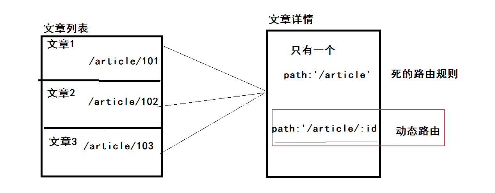
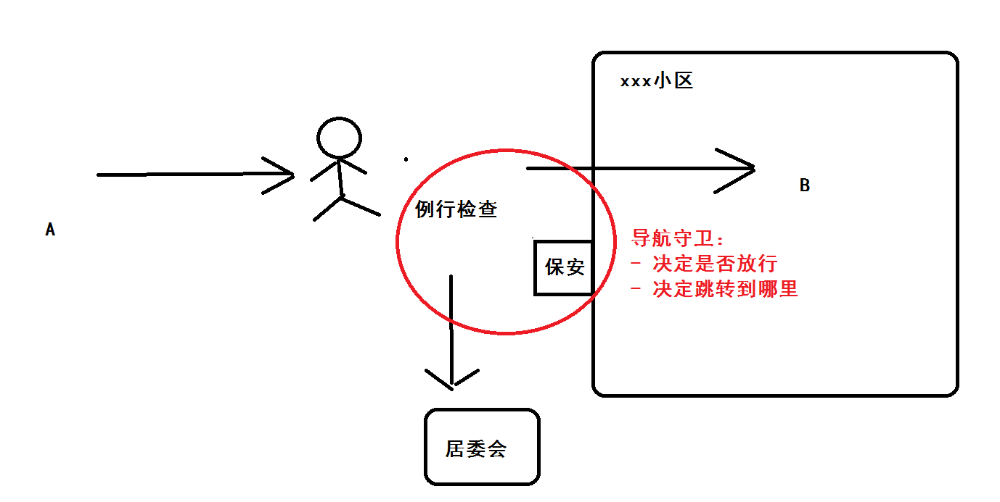
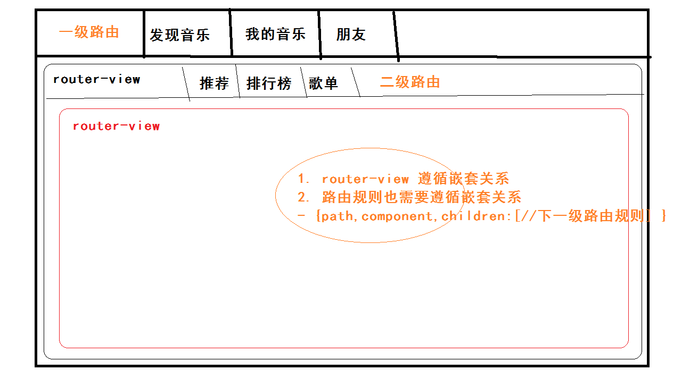
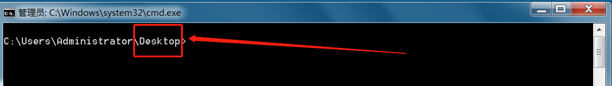
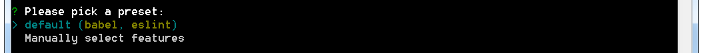
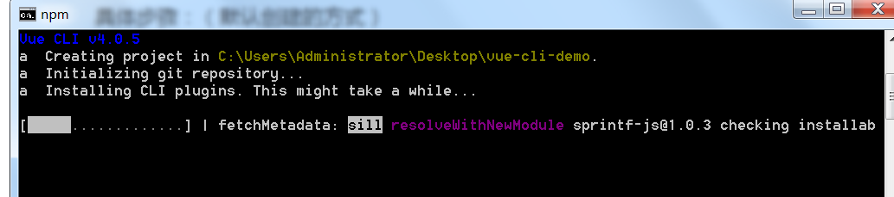
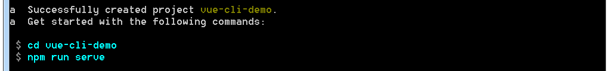
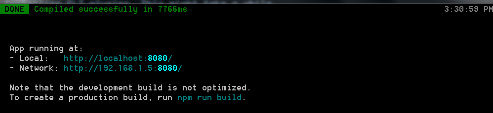
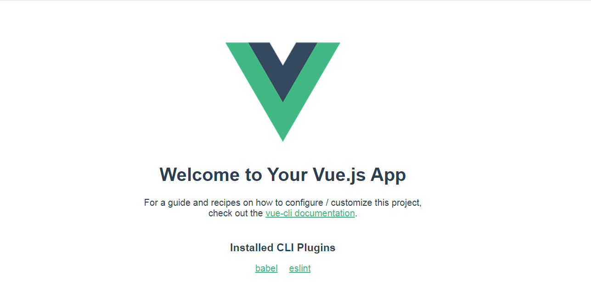
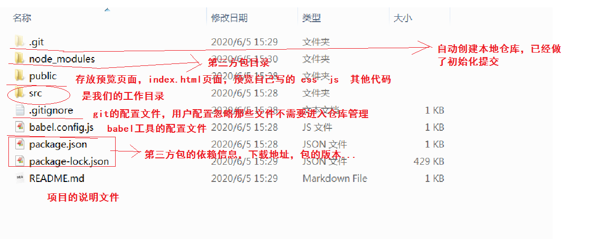

## VUE基础-day05


### 01-每日回顾

**组件**

- 概念：针对界面功能（HTML,CSS,JS）的封装，相互独立更好维护，提高复用度。
- 注册
  - 全局 `Vue.component(组件名称,组件配置对象)`
  - 局部 `new Vue({ components:{组件名称:组件配置对象} })`
- 命名：注册的时候 `btn-add`  `BtnAdd`  使用的时候 `btn-add`
- 传值（重要）
  - 父传子：
    - 使用子组件的时候，绑定属性   `<com-child :msg="父组件数据">`
    - 定义子组件的时候，使用props来接收属性值  `props:['msg']`   仅读
  - 子传父：
    - 使用子组件的时候，绑定自定义事件  `<com-child @abcd="$event就是触发自定义事件的传参">`
    - 定义子组件的时候，触发自定义事件 `子组件的vue实例.$emit('abcd',子组件的数据)`

例如：非父子传值，单文件组件  后面会使用讲解。


**前端路由**

- 概念：地址栏改变但是不刷新页面（不会请求HTML），根据地址栏的不同更新界面内容（切换业务场景）
- 改地址：
  - location.hash       hash实现模式
  - history.pushState()    history实现模式
- 理解hash实现的原理
- 知道vue-router插件的使用，实现的是：地址  映射  组件。
- 使用步骤：
  - 引入
  - 创建组件配置对象
  - 配置路由规则
  - 初始化路由
  - 挂载到vue根实例
  - 使用router-link代理a标签
  - 使用router-view指定组件渲染位置


### 02-★vue-router-动态路由

> 目标：能掌握动态路由的规则使用。

概念：不同的路由地址，需要指向同一个组件，这样的路由规则的实现，就叫动态路由。

换一句话：你定义的路由规则，需要匹配到不同的地址。

业务场景：



代码演示：

```html
<!DOCTYPE html>
<html>
  <head>
    <meta charset="UTF-8" />
    <meta name="viewport" content="width=device-width, initial-scale=1.0" />
    <title></title>
  </head>
  <body>
    <div id="app">
      <router-view></router-view>
    </div>
    <script src="./vue.js"></script>
    <script src="./vue-router.js"></script>
    <script>

      // 文章列表组件配置对象
      const List = {
        template:`<div>
          <h1>文章列表</h1>
          <router-link to="/article/101">文章1</router-link>  
          <router-link to="/article/102">文章2</router-link>  
          <router-link to="/article/103">文章3</router-link>  
        </div>`
      }
      // 文章详情组件配置对象
      const Article = {
        // $route 是vue实例上的数据对象,和data中数据的使用时一样的
        // $route.params 获取路径传参的（动态路由传参的）这是一个对象
        // $route.params 对象中的数据：键 根据path中的参数名称  值 地址栏上的参数数据了
        template: `<div><h1>文章详情</h1> {{$route.params.articleId}}</div>`
      }

      // 路由规则
      const routes = [
        {path: '/', component: List},
        {path: '/article/:articleId', component: Article}
      ]

      // 初始化
      const router = new VueRouter({ routes })

      const vm = new Vue({
        el: '#app',
        // 挂载
        router
      })
    </script>
  </body>
</html>
```

总结：

- 规则 `{path: '/article/:articleId', component: Article}`
- 参数 `$route.params.articleId`


### 03-★vue-router-属性to

> 目标：掌握to属性的各种用法

to属性可以写很多种形式的路径。

例如：

- `to="/article"`    静态的to属性
- `:to="{path:'/article',query:{id:101}}"`  === `to="/article?id=101"`
- `:to="{name:'article',params:{articleId:101}}"`  === `to="/article/101"`
  - 路由规则的名称  ` {name:'article', path: '/article/:articleId', component: Article}`

代码演示：

键值对

```html
      // 参数方式：键值对  /article?id=101
      const List = {
        data () {
          return {
            id: 10010
          }
        },
        template: `<div>
          <h1>列表</h1>
          <!--<router-link to="/article?id=101">键值对传参</router-link>--> 
          <!--<router-link :to="'/article?id='+id">键值对传参</router-link>-->
          <router-link :to="{path:'/article',query:{articleId:id}}">键值对传参</router-link>
        </div>`
      }
      const Item = {
        // $route  vue实例下的数据，代表路由信息对象，例如传参信息
        // 获取键值对传参  $route.query
        template: `<div>
          <h1>选项 {{$route.query.articleId}}</h1>
        </div>`
      }

      const router = new VueRouter({
        routes: [
          {path: '/', component: List},
          {path: '/article', component: Item}
        ]
      })
```

路径上

```html
// 参数方式：路径上  /article/101
       const List = {
        data () {
          return {
            id: 10010
          }
        },
        template: `<div>
          <h1>列表</h1>
          <!--<router-link to="/article/10010">路径上传参</router-link>-->
          <!--<router-link :to="'/article/'+id">路径上传参</router-link>-->
          <router-link :to="{name:'article',params:{id:id}}">路径上传参</router-link>
        </div>`
      }
      const Item = {
        template: `<div>
          <h1>选项 {{$route.params.id}}</h1>
        </div>`
      }

      const router = new VueRouter({
        routes: [
          {path: '/', component: List},
          {name:'article', path: '/article/:id', component: Item}
        ]
      })
```

总结：

- 怎么样通过to属性的对象写法，传递键值对参数   获取 `$route.query`
- 怎么样通过to属性的对象写法，传递路径上参数   获取 `$route.params`


### 04-★vue-router-编程式导航

> 目标：掌握不使用router-link进行跳转，通过js的方式进行跳转。

以前：

- 使用 A 标签进行跳转，如果没有 A 标签使用 location.href = '地址'

现在：

- 使用 router-link 进行跳转路由，如果没有 router-link 标签使用  `$router.push('静态地址'|对象)`

概念：

- 使用js的方式进行路由的跳转，就叫：编程式导航

区别 `$route` 和 `$router`  作用：

- `$route`  获取路由信息的（找数据）
- `$router`  获取路由实例的 ( 调方法 )
- 以上两个对象均可以通过 VUE实例去访问


场景：

- 异步的登录成功后，需要从登录跳转到首页。
- 这个时候就可以使用编程式导航，通过js进行跳转。


代码：

```html
<!DOCTYPE html>
<html>

<head>
  <meta charset="UTF-8" />
  <meta name="viewport" content="width=device-width, initial-scale=1.0" />
  <title></title>
</head>

<body>
  <div id="app">
    <router-view></router-view>
  </div>
  <script src="./vue.js"></script>
  <script src="./vue-router.js"></script>
  <script>

    // 路由实例对象
    const router = new VueRouter({
      // 路由规则
      routes: [
        {
          path: '/login', component: {
            template: `<div>登录页面  <button @click="login()">登录</button></div>`,
            methods: {
              login () {
                // 进行登录
                // 登录成功
                // 跳转首页
                // $router 是在vue实例上的 路由对象，其中有一个函数push函数可以跳转
                this.$router.push('/home')
                // this.$router.push({path:'/home',query:{}})
                // this.$router.push({name:'home',params:{}})
                // push当中的对象形式 和to属性中的对象写法规则一致
              }
            }
          }
        },
        {
          path: '/home', name:'home', component: {
            template: `<div>首页页面  欢迎您！！！</div>`
          }
        }
      ]
    })

    const vm = new Vue({
      el: '#app',
      router
    })
  </script>
</body>

</html>
```


总结：

- 如何通过js进行路由跳转 `$router.push()`


### 05-★vue-router-重定向

> 目标：掌握前端路由的重定向功能。

回忆：

- 在nodejs中大家使用的是express框架，其中有 response 对象 ， 函数redirect函数进行重定向。

```JS
app.get('/login',(req,res)=>{
  // 返回一个页面
  // res.send('页面')  res.json()
  // 重定向函数  跳转到其他页面
  // res.redirect('/admin')
})
```

概念：

- 当你访问的是 a 路径的时候，跳转的却是 b 路径。

业务场景：

- 我们路由默认的地址是 / 路径
- 但是我的首页 /home 路径
- 那么在访问 / 路径的时候需要自动跳转到 /home 路径 （需要使用重定向）

代码演示：

```html
<!DOCTYPE html>
<html>
  <head>
    <meta charset="UTF-8" />
    <meta name="viewport" content="width=device-width, initial-scale=1.0" />
    <title></title>
  </head>
  <body>
    <div id="app">
      <router-view></router-view>
    </div>
    <script src="./vue.js"></script>
    <script src="./vue-router.js"></script>
    <script>

      // 路由实例对象
    const router = new VueRouter({
      // 路由规则
      routes: [
        // 重定向
        { path: '/', redirect: '/home'  },
        {
          path: '/home', name:'home', component: {
            template: `<div>首页页面  欢迎您！！！</div>`
          }
        }
      ]
    })

      const vm = new Vue({
        el: '#app',
        router
      })
    </script>
  </body>
</html>
```

总结：

- 在vue-router是使用重定向功能 `{ path: '/', redirect: '/home'  },`


### 06-★vue-router-导航守卫

> 目标：能掌握路由中导航守卫的用法。

导航守卫概念：

- 在路由跳转的时候，可以介入。在跳转的过程中可以做其他的事情。

画图：



业务需求：

- 后台管理系统的（所有页面），必须要登录后才能访问。
- 如果没有登录，直接访问后台的页面，拦截到登录页面即可。
- 如果已经登录，放行即可。

代码演示：

```html
<!DOCTYPE html>
<html>
  <head>
    <meta charset="UTF-8" />
    <meta name="viewport" content="width=device-width, initial-scale=1.0" />
    <title></title>
  </head>
  <body>
    <div id="app">
      <router-view></router-view>
    </div>
    <script src="./vue.js"></script>
    <script src="./vue-router.js"></script>
    <script>

      const router = new VueRouter({
        routes: [
          {path: '/login', component: { template: '<div>登录页面</div>' }},
          {path: '/', component: { template: '<div>管理系统的首页页面</div>' }},
          {path: '/setting', component: { template: '<div>管理系统的设置页面</div>' }}
        ]
      })

      // 使用导航守卫，监听所有的路由跳转
      router.beforeEach((to,from,next)=>{
        // 这个回调函数在路由跳转的时候会执行
        // 模拟一下当前的登录状态
        const isLogin = false
        // 判断登录的状态
        // console.log(to)
        // to 是跳转的目标路由对象  to.path 目标路径
        // console.log(from)
        // from 是来自的目标路由对象  from.path 来自路径
        // next 是一个下一步执行函数：
        // next() 放行
        // next(路径) 拦截到哪里
        // 如果不是访问登录，且此时没有登录，那么跳转登录页面
        if (to.path!=='/login' && !isLogin) return next('/login')
        // 如果其他情况一律放行
        next()
      })


      const vm = new Vue({
        el: '#app',
        router
      })
    </script>
  </body>
</html>
```


总结：

- 可以使用导航守卫实现访问权限的控制。


### 07-★vue-router-路由嵌套

> 目标：掌握路由嵌套的写法

概念：

- 拥有一级路由，也会有有一级路由对应显示的容器（router-view）
- 拥有二级路由，也会有有二级路由对应显示的容器（router-view）

场景：



落地代码：

```html
<!DOCTYPE html>
<html>

<head>
  <meta charset="UTF-8" />
  <meta name="viewport" content="width=device-width, initial-scale=1.0" />
  <title></title>
</head>

<body>
  <div id="app">
    <nav>
      <router-link to="/">首页</router-link>
      <router-link to="/my">我的音乐</router-link>
      <router-link to="/friend">朋友</router-link>
    </nav>
    <div id="page">
      <router-view></router-view>
    </div>
  </div>
  <script src="./vue.js"></script>
  <script src="./vue-router.js"></script>
  <script>
    // 一级路由对应的组件
    const Home = {
      template: `<div>
        <h1>发现音乐界面</h1>
        <router-link to="/tj">推荐</router-link>
        <router-link to="/ph">排行榜</router-link>
        <router-link to="/gd">歌单</router-link>
        <router-view></router-view>
      </div>`}
    const My = { template: '<b>我的音乐界面</b>' }
    const Friend = { template: '<b>朋友界面</b>' }
    // 二级路由对应的组件
    const Tj = { template: '<div>推荐page</div>' }
    const Ph = { template: '<div>排行榜page</div>' }
    const Gd = { template: '<div>歌单page</div>' }

    const routes = [
      {
        path: '/', component: Home, children: [
          { path: '/tj', component: Tj },
          { path: '/ph', component: Ph },
          { path: '/gd', component: Gd }
        ]
      },
      { path: '/my', component: My },
      { path: '/friend', component: Friend }
    ]

    const router = new VueRouter({ routes })

    const vm = new Vue({
      el: '#app',
      router
    })
  </script>
</body>

</html>
```


总结：

- router-view路由标签需要有嵌套关系
- 路由规则也需要嵌套关系，通过规则对象中的 children 属性，来实现嵌套关系配置。


### 08-vue-cli-介绍

> 目标：了解vue-cli的作用

脚手架：

-  **脚手架**是为了保证各施工过程顺利进行而搭设的工作平台。 

vue脚手架：

- 为了在开发项目的过程中能够顺利的进行而搭建的一个基础的项目结构。
- 它会为我们创建一套，相对标准的项目目录开发结构。
- 它还可以为我们在项目开发过程中，提供一些比较便利的开发辅助的工具。
  - babel工具    把你写的ES6语法降级，兼容更多的浏览器
  - less解析（sass less）工具   帮你把less解析成csss
  - eslint工具   约束你的代码风格，统一代码风格，做代码风格检查的。
  - ....
  - 还集成了webpack工具，包含一个dev-server工具，提供一个预览代码的服务器
    - 自动刷新浏览
    - 热更新功能


总结：

- vue-cli在开发阶段给予我们开发时的便利。
- 让我们专注实现业务，而不是一些项目开发的辅助工作。

- 文档  https://cli.vuejs.org/zh/guide/ 


### 09-vue-cli-安装

> 目标：知道如何安装vue-cli即可

安装的命令

```bash
# 通过npm包管理工具进行全局安装
npm install -g @vue/cli
# OR
# 或者使用 yarn包管理关键进行全局的安装
yarn global add @vue/cli
```

安装的问题

- 安装的速度慢：`npm i -g @vue/cli --registry=https://registry.npm.taobao.org`
- 以前安装过2.0版本的vue-cli工具
  - 先卸载  `npm un -g vue-cli`
  - 再安装

检查版本

```bash
vue --version
```


### 10-vue-cli-创建项目

> 目标：使用vue-cli创建vue项目

创建项目：

```bash
# 在任何目录下执行命令，项目名称英文的，不能和包的名字重名，例如：vue vue-cli vue-router 。。。
vue create 项目名称
```



你的命令行目录在哪里，项目就在哪个目录下。


具体步骤：（默认创建的方式）

- 执行创建命令


- 选择创建方式（1. 默认创建  2. 自定义创建 ）



- 回车之后，下载项目需要的包，等待即可。



- 成功的日志，教你怎么启动项目



- 启动项目（在项目的根目录下执行 npm run serve）


- 启动成功的日志



根据日志访问项目。




### 11-vue-cli-目录结构

> 目标：了解vue-cli创建的项目目录对应的作用。

项目根目录



工作目录


