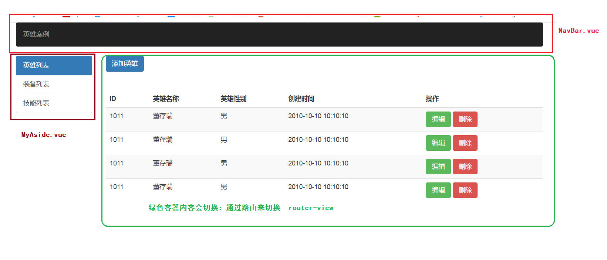

## VUE基础-day05

### 01-每日回顾

vue-router

- 动态路由：当你的一个路由规则需要匹配到多个不同的路由路径的时候
  - `{path:'/article/:id', name:'article', component:'组件配置对象'}`
- router-link组件的to属性写法（路由传参）
  - /user?id=100&name=tom  键值对传参
    - `:to="{path:'/user',query:{id:100,name:'tom'}}"`
  - /user/:id/:name  ===  /user/100/tom   路径传参
    - `:to="{name:'user',params:{id:100,name:'tom'}}"`

- 编程式导航：在js代码中进行路由的跳转
  - 在vue-router的实例中，有一个函数push可以进行跳转
  - 在vue实例中有一个属性`$router`就是路由实例，`this.$router.push(地址)`
  - 还可以传对象，规则和to属性的规则是一致的。
- 重定向：当你访问 地址A的时候，需要自动跳转的地址B 
  - `{path:'/', redirect: '/home'}`
- 导航守卫：当你需要在路由跳转的时候做一些事件
  - 例如：访问权限的控制
  - 路由实例提供了一个函数  beforeEach
  - `router.beforeEach((to,from,next)=>{ //处理逻辑 })`
    - next()   放行   next('/login')  拦截跳转
- 路由嵌套：多级页面的局部更新
  - router-view组件需要嵌套
  - 路由规则也需要呈现出嵌套的关系，规则对象中：children属性

vue-cli

- 安装 `npm i -g @vue/cli`
- 创建项目  `vue create 项目名称`
- 目前使用默认的创建方式 default
- 启动项目：在项目的根目录下执行 `npm run serve`

通过main.js找项目依赖的所有资源---->把这些资源打包在一起----->注入自动添加到index.html页面---->在localhost:8080的服务预览

main.js称为：**入口文件**


代码：$mount() 和 el 作用一致，指定跟根容器

代码：render函数，把App.vue组件渲染在，渲染在根容器，替换式渲染。

- 就是把App.vue中的内容当中根容器内容。
- 以后其他组件都是在App.vue组件中使用。


### 02-ES6模块化

> 目标：掌握ES6模块化开发的，导入和导出。

前置提醒：ES6 commonJS 模块化的实现不能再前端浏览器中使用，浏览器不支持。

在vue-cli中，会把ES6的模块化实现，通过vue-cli实现成浏览器能够支持的模块化代码。


第一种写法：默认导出和默认导入

```js
// 使用默认导出
// 只能默认导出一次
// 可以导出任何东西
const str = '默认导出的数据'
export default str
```

```js
// ES6默认导入
// import 变量名称(接收默认导出的内容)  from  '路径|包名称'
import myStr from './myModule'
console.log(myStr)
```

第二种写法：指定成员导出和指定成员导入（按需导出和按需导入）

```js
// a 属于模块内部变量
const a = 10
// 按需导出 b 成员
export const b = 20
// 按需导出 c 成员
export const c = a + b 
```

```js
// ES6按需导入写法
// 1. 如果接收所有的按需导出的成员
// import * as all from './myModule'
// console.log(all) === {b:20,c:30}
// 2. 只想接收其中某一个成员
// 强调：这里不是解构赋值，这是模块化的语法
import { b } from './myModule'
import { b as otherB } from './myModule'
console.log(b)
console.log(otherB)
// as 是取别名的意思
```

混合写法

```js
// a 属于模块内部变量
const a = 10
// 按需导出 b 成员
export const b = 20
// 按需导出 c 成员
export const c = a + b 

export default '默认的'
```

```js
// 混合写法
// 得到默认成员 得c成员  
import str, { c } from './myModule'
console.log(str,c)
```


### 03-单文件组件

> 目标：能够掌握单文件组件的写法即可

单文件组件，就是以 .vue 后缀的文件，内容是有语法规则的。

可以书写三种个标签：

- template  书写组件模板（视图）写html的，对应template选项
- script  书写组件逻辑（data，methods，...）
- style  书写组件样式

下面代码演示：

```html
<template>
  <!-- 单文件组件：必须拥有template标签  -->
  <!-- 书写组件模板的，相当于组件配置选项中的template选项 -->
  <!-- 组件模板必须有一个根标签 -->
  <div class="root">
    {{msg}}
  </div>
</template>
<script>
// 除去template模板，你还想定义其他选项，在export default {} 书写其他选项。
export default {
  data () {
    return {
      msg: '信息'
    }
  },
  methods: {},
  computed: {}
}
</script>
<style scoped>
  /* 书写样式的地方 */
  /* 1. style标签  内部的样式默认在所有的组件下户生效 */
  /* 2. style标签 scoped 作用域  此时样式仅仅只会在当前组件生效  */
  /* 3. lang="less|scss|stylus" 指定使用什么css预处理器 */
  /* 现在不能写：通过vue-cli创建项目的时候，没有选择使用何种css预处理器，写上不支持 */
</style>
```


总结：一个单文件组件必须有一个template标签

补充：如果导入了这个单文件组件，其实得到的是和  组件配置对象  一致的东西

- 如果使用需要注册，或者配置在路由是使用。


### 04-hero案例-项目介绍

  

使用vue-cli来实现英雄案例：

- 英雄列表
  - **列表组件**
  - **删除功能**
  - **添加组件**
  - **编辑组件**
- 装备列表
- 技能列表

注意：三个菜单的切换效果需要实现的。


### 05-hero案例-静态界面

通过bootstrap搭建的，版本是3.3.7

```html
<!DOCTYPE html>
<html lang="en">
<head>
  <meta charset="UTF-8">
  <meta name="viewport" content="width=device-width, initial-scale=1.0">
  <title>Document</title>
  <link rel="stylesheet" href="https://cdn.bootcdn.net/ajax/libs/twitter-bootstrap/3.3.7/css/bootstrap.min.css">
</head>
<body>
  <div class="container">
    <!-- 导航栏 -->
    <nav class="navbar navbar-inverse">
      <p class="navbar-text">英雄案例</p>
    </nav>
    <!-- 内容 -->
    <div class="row">
      <div class="col-md-2">
        <!-- 左菜单 -->
        <div class="list-group">
          <a href="#" class="list-group-item active">英雄列表</a>
          <a href="#" class="list-group-item">装备列表</a>
          <a href="#" class="list-group-item">技能列表</a>
        </div>
      </div>
      <div class="col-md-10">
        <!-- 英雄列表 -->
        <button class="btn btn-primary">添加英雄</button>
        <hr>
        <table class="table table-striped">
          <thead>
            <tr>
              <th>ID</th>
              <th>英雄名称</th>
              <th>英雄性别</th>
              <th>创建时间</th>
              <th>操作</th>
            </tr>
          </thead>
          <tbody>
            <tr>
              <td>1011</td>
              <td>董存瑞</td>
              <td>男</td>
              <td>2010-10-10 10:10:10</td>
              <td>
                <button class="btn btn-success">编辑</button>
                <button class="btn btn-danger">删除</button>
              </td>
            </tr>
            <tr>
              <td>1011</td>
              <td>董存瑞</td>
              <td>男</td>
              <td>2010-10-10 10:10:10</td>
              <td>
                <button class="btn btn-success">编辑</button>
                <button class="btn btn-danger">删除</button>
              </td>
            </tr>
            <tr>
              <td>1011</td>
              <td>董存瑞</td>
              <td>男</td>
              <td>2010-10-10 10:10:10</td>
              <td>
                <button class="btn btn-success">编辑</button>
                <button class="btn btn-danger">删除</button>
              </td>
            </tr>
            <tr>
              <td>1011</td>
              <td>董存瑞</td>
              <td>男</td>
              <td>2010-10-10 10:10:10</td>
              <td>
                <button class="btn btn-success">编辑</button>
                <button class="btn btn-danger">删除</button>
              </td>
            </tr>
          </tbody>
        </table>
      </div>
    </div>
  </div>
</body>
</html>
```

总结：让大家了解其结构，会拆分成组件。


### 06-hero案例-公用组件

创建项目

- 创建命令  vue create hore-project-all
- 等待下载...
- 修改目录结构
  - 删除默认的一些代码
  - 新建一个 views 放置路由级别组件
- 在项目的根目录下启动
- 把项目共享到码云
  - 地址： https://gitee.com/zhoushugang/hore-project-all 
  - 每做一个步骤，会提交一次
  - 希望大家，在我的每次提交记录中，可以找到实现一个功能修改了什么代码。


公用组件

- 引入bootstrap样式

```bash
# 项目根目录下执行安装
npm i bootstrap@3.3.7
```

`main.js`  导入

```js
import 'bootstrap/找到包中的css文件'
```

- 分析布局结构



- 需要定义两个公用的组件 NavBar  MyAside    

`src/components/NavBar.vue`

```html
<template>
  <nav class="navbar navbar-inverse">
    <p class="navbar-text">英雄案例</p>
  </nav>
</template>
```

`src/components/MyAside.vue`

```html
<template>
  <div class="list-group">
    <a href="#" class="list-group-item active">英雄列表</a>
    <a href="#" class="list-group-item">装备列表</a>
    <a href="#" class="list-group-item">技能列表</a>
  </div>
</template>
```

`App.vue` 使用组件

导入组件

```js
// NavBar 相对于组件配置对象 {template:'<div>内容</div>'}
import NavBar from "./components/NavBar.vue"
// MyAside 相对于组件配置对象 {template:'<div>内容</div>'}
import MyAside from "./components/MyAside.vue"
```

注册组件

```diff
export default {
  // 组件的配置选项，代表组件名字的标识。
  name: "App",
  // 注册组件
+  components: { NavBar, MyAside}
};
```

使用组件

```html
<template>
  <div id="app" class="container">
    <!-- 导航组件 -->
    <nav-bar></nav-bar>
    <!-- 内容 -->
    <div class="row">
      <div class="col-md-2">
        <!-- 侧边栏组件 -->
        <my-aside></my-aside>
      </div>
      <div class="col-md-10">
        <!-- 路由组件router-view -->
      </div>
    </div>
  </div>
</template>
```


总结：

- 提取组件，为了可维护性。


### 07-hero案例-实现路由

实现路由的基本步骤：

- 安装与导入

```bash
# 在项目根目录下 安装vue-router
npm i vue-router
```

```js
// 在main.js中导入vue-router
import VueRouter from 'vue-router'
```

- 如果是**在vue-cli中**，需要有一个使用的动作

```js
// 在vue中使用这个插件
Vue.use(VueRouter)
```

- 准备组件，HoreList.vue  ZbList.vue  JnList.vue  在`scr/views` 下定义

```html
<template>
  <div>英雄组件</div>
</template>
```

```html
<template>
  <div>装备组件</div>
</template>
```

```html
<template>
  <div>技能组件</div>
</template>
```

- 配置路由规则

```js
// 导入定义好的路由级别组件
import HoreList from './views/HoreList.vue'
import ZbList from './views/ZbList.vue'
import JnList from './views/JnList.vue'
// 配置路由规则
const routes = [
  // 让首页默认跳转英雄列表
  { path: '/', redirect: '/hore' },
  { path: '/hore', component: HoreList },
  { path: '/zb', component: ZbList },
  { path: '/jn', component: JnList },
]
```

- 初始化路由

```js
const router = new VueRouter({ routes })
```

- 挂载到根vue实例

```diff
new Vue({
  render: h => h(App),
+  router
}).$mount('#app')
```


进行使用：

`src/components/MyAside.vue `  把a改成router-link组件

```html
  <div class="list-group">
    <router-link to="/hore" class="list-group-item active">英雄列表</router-link>
    <router-link to="/zb" class="list-group-item">装备列表</router-link>
    <router-link to="/jn" class="list-group-item">技能列表</router-link>
  </div>
```

`App.vue` 组件放置 router-view 组件，渲染路由对应的组件

```html
      <div class="col-md-10">
        <!-- 路由组件router-view 指定路由对应的组件显示的位置-->
        <router-view></router-view>
      </div>
```


总结：

- 注意import导入的vue-router需要Vue.use()使用以下。


### 08-hero案例-路由激活样式

- 路由激活样式

需要根据当前的路由地址，去激活导航菜单的选中样式


第一种实现方式：

发现，激活导航菜单的类是bootstrap提供的active类名

发现，当访问的地址和导航菜单to属性的地址相同的时候，vue-router会自动加上两个类：

-  router-link-exact-active   精确    地址 /hore  to="/hore"
  - 当你地址栏的路由路径，和导航菜单上的to属性路径，完全一致的时候会加上。
-  router-link-active  模糊  地址 /hore/list to="/hore"
  - 当你地址栏的路由路径，以导航菜单上的to属性路径开头，就会加上这个类名。

思路：把active去掉，把active中的样写在上面两个类名中的任何一个下即可。

代码： `src/components/MyAside.vue`

```html
<style>
/* 激活样式 */
.list-group-item.router-link-exact-active, 
.list-group-item.router-link-exact-active:hover, 
.list-group-item.router-link-exact-active:focus {
    z-index: 2;
    color: #fff;
    background-color: #337ab7;
    border-color: #337ab7;
}
</style>
```


第二种实现方式：

文档： 

- https://router.vuejs.org/zh/api/

得到：

- exact-active-class  可以配置  精确的类名   router-link上的属性
- active-class  可以配置  模糊的类型  router-link上的属性

思路：

- 把vue-router默认添加的类名，改成bootstrap支持active类名即可。
- linkActiveClass 模糊  linkExactActiveClass 精确  在 new VueRouter({}) 使用的配置

代码：`main.js`

```js
// 初始化路由
// linkExactActiveClass: 'active' 
// 把vue-router默认添加的类名，改成bootstrap支持active类名
const router = new VueRouter({ routes, linkExactActiveClass: 'active' })
```


###  09-hero案例-提取路由模块

问题：

- main.js的职责是，直接或间接依赖项目需要的资源，创建VUE根实例。
- 现在在main.js中配置了vue-router的相关代码
- 如果又有很多插件需要配置，而且都在main.js进行配置，代码很难维护

解决：

- 提取路由模块，放到   `src/router.js`  模块中进行配置。

代码： `src/router.js` 

```js
// 这个模块的职责是配置路由

// 导入包
import Vue from 'vue'
import VueRouter from 'vue-router'


// 导入组件
import HoreList from './views/HoreList.vue'
import ZbList from './views/ZbList.vue'
import JnList from './views/JnList.vue'

// 使用插件
Vue.use(VueRouter)

// 配置路由规则
const routes = [
  // 让首页默认跳转英雄列表
  { path: '/', redirect: '/hore' },
  { path: '/hore', component: HoreList },
  { path: '/zb', component: ZbList },
  { path: '/jn', component: JnList },
]

// 实例化
const router = new VueRouter({ routes, linkExactActiveClass: 'active' })


// router需要在vue根实例下挂载
// 1. 导出 router 实例
// 2. 在main.js导入router实例，进行挂载即可
export default router
```

`main.js` 需要导入

```diff
// 导入自己初始化的router实例
import router from './router'
```


###  10-hero案例-列表组件

使用json-server创建一套接口支持英雄案例：

- 在db.json中加入

```json
  "hore": [
     {"id":1,"horeName":"赵云","gender":"男","time":"2010/09/11 10:09:46" },
     {"id":2,"horeName":"赵信","gender":"男","time":"2020/09/11 12:09:46" }
  ]
```

- 启动接口服务，在db.json目录下，执行 json-server db.json


实现的大致的步骤：

- 完组件的基础布局
- 在组件初始化的时候，通过axios获取后台数据。
  - 安装axios  `npm i axios`
  - 导入axios
  - 发列表请求  ` http://localhost:3000/hore `
- 模板中渲染
  - 依赖的数据需要在data中先声明    horeList
  - 只需在获取数据后给horeList赋值即可
  - 在模板中使用  插值表达式或者指令 进行渲染
  - 处理无数据的情况

落地代码：`src/views/HoreList.vue`

```html
<template>
  <div class="hore-list">
    <button class="btn btn-primary">添加英雄</button>
    <hr />
    <table class="table table-striped">
      <thead>
        <tr>
          <th>ID</th>
          <th>英雄名称</th>
          <th>英雄性别</th>
          <th>创建时间</th>
          <th>操作</th>
        </tr>
      </thead>
      <tbody>
        <tr v-for="item in horeList" :key="item.id">
          <td>{{item.id}}</td>
          <td>{{item.horeName}}</td>
          <td>{{item.gender}}</td>
          <td>{{item.time}}</td>
          <td>
            <button class="btn btn-success" style="margin-right:10px">编辑</button>
            <button class="btn btn-danger">删除</button>
          </td>
        </tr>
        <tr v-if="horeList.length===0">
          <td colspan="5" style="text-align:center">暂无数据</td>
        </tr>
      </tbody>
    </table>
  </div>
</template>
<script>
// 引入axios
import axios from 'axios'
export default {
  // 组件初始化的时候执行
  created () {
    // 获取后台数据
    this.getHoreList()
  },
  data () {
    return {
      horeList: []
    }
  },
  methods: {
    getHoreList () {
      // 1. 发获取英雄列表的请求
      // 2. 获取数据后给 horeList 赋值即可
      axios.get('http://localhost:3000/hore').then(res=>{
        // res.data 就是后台返回的英雄列表数据
        this.horeList = res.data
      })
    }
  }
}
</script>
```


### 11-hero案例-时间过滤

实现的大致步骤：

- 定义过滤器
- 使用moment做日期转换
  - 安装 npm i moment
  - 导入使用  moment(日期对象).format('YYYY-MM-DD HH:mm:ss')
- 在模板中使用即可

落地代码：`src/views/HoreList.vue`

安装moment

```bash
npm i moment
```

定义过滤器

```js
// 导入moment
import moment from 'moment'
```

```js
  // 过滤器
  filters: {
    formatTime (time) {
      // time 使用该过滤器的管道符前js表达式执行的结果
      return moment(new Date(time)).format('YYYY-MM-DD HH:mm:ss')
    }
  },
```

使用过滤器

```html
<td>{{item.time|formatTime}}</td>
```


### 12-hero案例-删除功能

实现的大致步骤：

- 绑定删除按钮的点击事件
- 点击的时候弹出确认框
- 点击确认的时候发生删除请求
- 删除成功后更新当前列表

落地代码：

- 绑定事件

```html
<button @click="delHore(item.id)" class="btn btn-danger">删除</button>
```

- 处理函数

```js
    // 删除函数
    delHore (id) {
      if (confirm('老铁，您是否删除该英雄？')) {
        // 删除请求
        axios.delete(`http://localhost:3000/hore/${id}`).then(()=>{
          // 删除成功后更新列表
          this.getHoreList()
        })
      }
    }
```


后面需要实现的功能：(挑战)

点击添加英雄------>切换到添加组件

点击编辑英雄------>切换到编辑组件


### 13-忽略代码风格检查

问题：我们是默认创建的vue-cli项目

- 默认有一个功能，会去检查的你的代码风格，如果代码风格不符合要求项目无法启动。
  - 不是你的代码写错了，是风格不好罢了。
  - 定义的变量不使用（不好）
  - 导入优先，import类型代码顶置的去写
  - ....
- 可以配置不去做代码风格的检查，正常启动项目。

解决：关闭代码风格检查

项目的根目录 `vue.config.js`  创建文件

```js
// vue-cli的配置文件，按照commonJS规范导出
module.exports = {
  // 项目启动的时候不做检查
  lintOnSave: false
}
// 配置文件的修改，需要重新启动项目
```

重新启动项目


